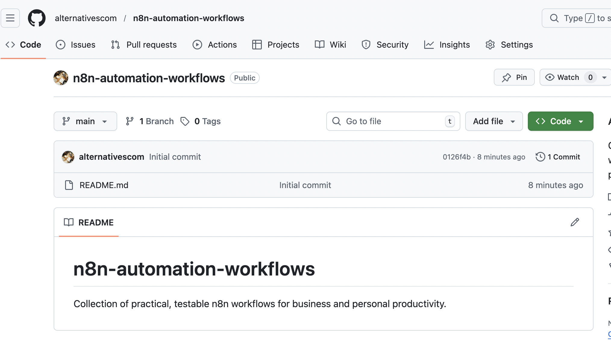

# AI Book Advisor: Reviews & Recommendations (Monetization Ready) 📚

## Overview
**Turn book curiosity into affiliate revenue.** 💰
This workflow acts as an automated "Book Curator." It accepts a book title request, researches reviews using Google Search, analyzes them with an AI Agent (GPT-4o), and delivers a rich HTML email with a summary, related recommendations, and **Amazon Affiliate links**.

## Key Features
- **🤖 AI Agent Analysis:** Uses LangChain Agent to synthesize web reviews and generate personalized recommendations.
- **💸 Monetization Ready:** Automatically appends your Amazon Associate Tag to purchase links.
- **📧 Rich HTML Emails:** Sends beautiful, mobile-responsive emails with book covers and formatted layouts.
- **📊 Database Logging:** Archives all requests and AI insights to Google Sheets for future analysis.

## How It Works
1. **Input:** User submits a book title (and optional author) via an n8n Form.
2. **Enrichment:**
   - Fetches metadata (Cover, ISBN) via **Google Books API**.
   - Searches for real-world reviews via **Google Custom Search API**.
3. **Analysis:** The AI Agent reads the reviews, summarizes the book's appeal, and suggests 3 related books in a structured JSON format.
4. **Delivery:** Generates an HTML email with affiliate links and sends it to the user.

## Setup Steps
1. **Import:** Import `workflow.json` into your n8n instance.
2. **Credentials:** Set up credentials for:
   - OpenAI (GPT-4o)
   - Google Books API (No auth required usually, or API Key)
   - Google Custom Search API
   - Gmail & Google Sheets
3. **Configuration:**
   - Open the **"Workflow Configuration"** node (Set node).
   - Enter your API Keys and your **Amazon Affiliate Tag** (e.g., `mytag-22`).
   - *Note: Mock values are currently set as placeholders.*
4. **Google Sheets:** Create a sheet with these columns: `date`, `book_title`, `author`, `ai_comment`, `user_email`.

## Requirements
- n8n v1.x or later
- OpenAI API Key
- Google Cloud Platform Project (for Custom Search & Books API)
