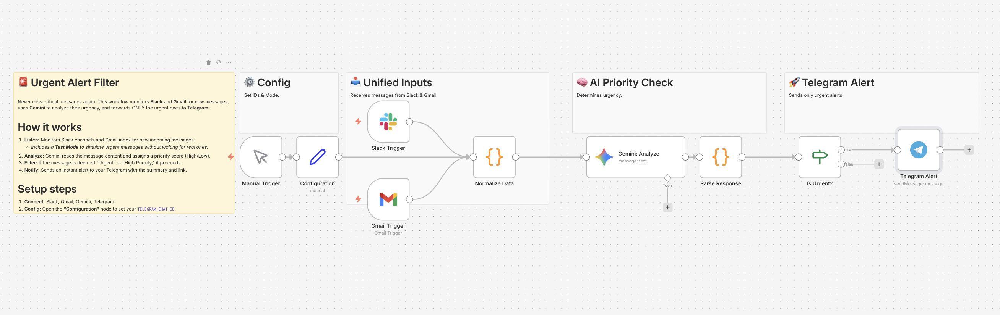

# 🚨 02 - Urgent Alert Filter（AI緊急通知仕分けボット）

## 💡 概要 (Overview)
**「通知の海から、『本当にヤバい連絡』だけを救い出します。」**

Urgent Alert Filterは、日々大量に送られてくるメールやチャットのメッセージをAI（Gemini）がリアルタイムに分析し、**「今すぐ対応が必要な緊急の連絡」のみを抽出し、確実に気付ける場所（ダイレクトメッセージやSMSなど）へ転送する**n8nワークフローです。

単なる「特定のキーワードへの反応」ではなく、AIが文脈から「顧客の怒り度合い」や「事態の深刻さ」を読み取るため、ノイズを極限まで減らします。

## 🎯 解決する課題 (Pain Points)
* Slackのチャンネルやメールの受信トレイが未読で溢れかえり、重要な連絡を見落とす恐怖がある。
* VIP顧客からの問い合わせや、システム障害のアラートなど、初動の遅れが致命傷になる業務を抱えている。
* 通知が鳴るたびに作業を中断して確認する「通知疲れ（コンテキスト・スイッチ）」に悩まされている。

## ⚙️ ワークフローの仕組み (How it Works)
1. **トリガー:** 指定のメールボックスやSlackチャンネルにメッセージが届くと起動します。
2. **AIによる文脈分析:** `Gemini` ノードがメッセージ全文を読み込み、「緊急度（高・中・低）」と「対応の要否」を判定します。
3. **条件分岐:** 緊急度が「高」と判定された場合のみ、次のノードへ進みます。
4. **即時通知:** スマホに直接届くSlackのDM、LINE、あるいはTwilioを通じたSMSや自動音声通話など、「絶対に気づく手段」でアラートを鳴らします。

## 🚀 使い方 (How to Use)
1. このリポジトリ内の `workflow.json` をダウンロードします。
2. ご自身のn8n環境を開き、ワークフロー画面で「Import from File」を選択して読み込みます。
3. トリガーノード（Email ReadやSlack等）と、通知先ノードにご自身のアカウント情報を設定します。
4. `Gemini` ノードにAPIキーを設定し、必要に応じて「VIP顧客の企業名」などをプロンプトに追記してください。

## 💡 カスタマイズのヒント
* **特定の顧客をエコ贔屓する:** AIへのプロンプトに「株式会社〇〇からの連絡は、内容に関わらず最優先とする」と指定することで、重要な取引先を逃しません。
* **Twilioとの連携（上級編）:** 最後の通知先を `Twilio` ノードに変更することで、深夜の緊急トラブル時に「物理的に電話のベルを鳴らして叩き起こす」最強のアラートシステムに進化します。

---
**Created by [Alternative Computers](https://alternativecomputers.org/)** 「重要な通知が埋もれてしまう」といった業務のボトルネック解消や、自動化システム構築のご相談は、お気軽にお問い合わせください。
