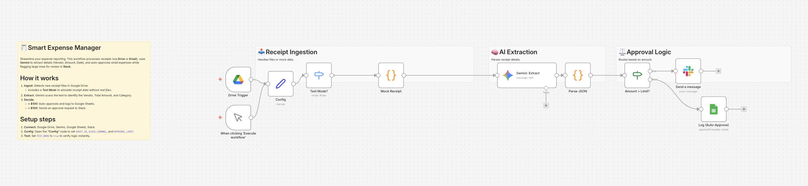

# Smart Expense Manager with AI Receipt Scanning 🧾

## Overview
**Automate expense reporting and approvals using AI.**
This workflow monitors **Google Drive** for new receipts, uses **Gemini (AI)** to extract key details (Vendor, Date, Amount), and applies business logic to route them automatically.

It prevents approval bottlenecks by auto-approving small expenses while flagging larger ones for manual review.

## Key Features
- **🤖 AI Extraction:** Automatically parses unstructured text from receipt images/PDFs.
- **⚖️ Smart Routing:**
  - **< $100:** Auto-approved & logged to Google Sheets.
  - **> $100:** Sent to Slack for manager approval.
- **🧪 Built-in Test Mode:** Simulates a receipt scan (e.g., "$125 Uber Ride") to verify logic instantly.

## How It Works
1. **Ingest:** Watches a specific Google Drive folder for new files.
2. **Extract:** Gemini analyzes the file and extracts structured data.
3. **Route:** Checks the total amount against your defined limit.
4. **Action:** Updates the spreadsheet or sends a Slack alert based on the amount.

## Setup Steps
1. **Import:** Import `workflow.json` into n8n.
2. **Credentials:** Set up credentials for Google Drive, Sheets, Gemini, and Slack.
3. **Google Sheets:** Create a sheet named `Expenses` with headers: `Date`, `Vendor`, `Amount`, `Status`.
4. **Config:**
   - Open the **"Config"** node.
   - Set `APPROVAL_LIMIT` (default: 100), `SHEET_ID`, and `SLACK_CHANNEL`.
   - Set `TEST_MODE` to `true` for initial testing.

## Requirements
- n8n v1.x or later
- Google Gemini API Key
- Google Drive & Sheets Access
