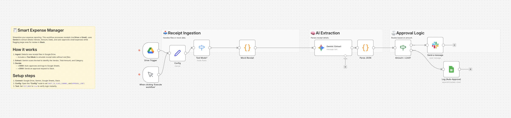

# 💸 03 - Smart Expense Manager（AI全自動・経費精算ボット）

## 💡 概要 (Overview)
**「月末のレシートの山を、一瞬で『美しい帳簿』に変換します。」**

Smart Expense Managerは、レシートや領収書の画像（またはPDF）をAI（Gemini Vision等）で解析し、「日付・金額・支払先」の抽出から「適切な勘定科目の推論」までを行い、指定のスプレッドシートやデータベースへ自動記帳するn8nワークフローです。

特に4月の決算期など、大量の領収書を前に途方に暮れる時間をゼロにし、人間を「手入力と仕訳の苦痛」から解放します。

## 🎯 解決する課題 (Pain Points)
* 月末や期末になると、財布に溜まったレシートの入力作業で半日が潰れる。
* 「これ、消耗品費？ 会議費？」と、毎回勘定科目の仕訳に迷って手が止まる。
* 手入力による金額の打ち間違いや、日付のズレなどのヒューマンエラーが後を絶たない。

## ⚙️ ワークフローの仕組み (How it Works)

1. **トリガー:** Slackの専用チャンネルにレシート画像を投稿、あるいは指定のメールアドレスに領収書PDFを転送すると起動します。
2. **AI画像解析:** `Gemini` ノードが画像を読み込み、必要な情報（日付、金額、店舗名など）を正確に抽出します。
3. **自動仕訳:** 抽出した情報を元に、AIが「タクシー代だから旅費交通費」「PC周辺機器だから消耗品費」と勘定科目を自動で推論します。
4. **自動記帳:** GoogleスプレッドシートやNotionのデータベースの指定行に、整形されたデータとして自動追記します。

## 🚀 使い方 (How to Use)
1. このリポジトリ内の `workflow.json` をダウンロードします。
2. ご自身のn8n環境を開き、ワークフロー画面で「Import from File」を選択して読み込みます。
3. `Google Sheets` などの記録先ノードにご自身のアカウントを認証させ、連携先シートを指定します。
4. `Gemini` ノードにAPIキーを設定し、必要に応じて自社独自の勘定科目ルールをプロンプトに追記してください。

## 💡 カスタマイズのヒント
* **会計ソフトへの直接連携:** スプレッドシートの代わりに、`HTTP Request` ノードを使ってfreeeやマネーフォワード等のAPIを直接叩き、仕訳データとして流し込むことも可能です。
* **例外検知アラート:** 「1回の経費が5万円を超えた場合」や「接待交際費の場合」のみ、承認者のSlackへ自動でメンションを飛ばす分岐（Switchノード）を追加すると、内部統制の強化にも繋がります。

---
**Created by [Alternative Computers](https://alternativecomputers.org/)** 経理部門のDX化、バックオフィス業務の劇的な効率化でお悩みの方は、有限会社野田収一事務所までお気軽にお声がけください。
