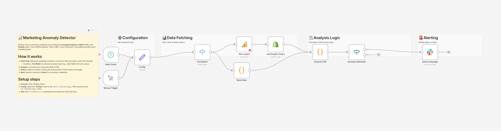

# Marketing Anomaly Detector (GA4 & Shopify) 📈

## Overview
**Monitor your e-commerce health by detecting traffic-sales mismatches.**
This workflow acts as a marketing watchdog. It cross-references daily traffic data from **Google Analytics 4 (GA4)** with sales data from **Shopify**. It automatically detects "High Traffic / Low Conversion" anomalies—often a sign of broken checkout flows or mismatched ad targeting—and alerts your team on Slack.

## Key Features
- **📊 Cross-Platform Analysis:** Unifies data from Google Analytics and Shopify in one view.
- **📉 Smart Thresholds:** Calculates Conversion Rate (CVR) and alerts only when traffic is high BUT sales are low.
- **🧪 Built-in Test Mode:** Generates mock anomaly data (3000 sessions / 5 orders) to verify the alert logic instantly without waiting for a real crisis.

## How It Works
1. **Fetch:** Retrieves yesterday's session count (GA4) and total order count (Shopify).
2. **Analyze:** Calculates the CVR automatically.
3. **Detect:** Compares against your defined `TRAFFIC_THRESHOLD` and `CVR_THRESHOLD`.
4. **Alert:** Sends a detailed warning to Slack if an anomaly is found.

## Setup Steps
1. **Import:** Import `workflow.json` into n8n.
2. **Credentials:** Set up credentials for GA4, Shopify, and Slack.
3. **Config:**
   - Open the **"Config"** node.
   - Set `TRAFFIC_THRESHOLD` (Default: 1000) and `CVR_THRESHOLD` (Default: 1.5%).
   - Set `TEST_MODE` to `true` to simulate an anomaly.

## Requirements
- n8n v1.x or later
- Google Analytics 4 Account
- Shopify Admin API Access
- Slack Webhook URL
