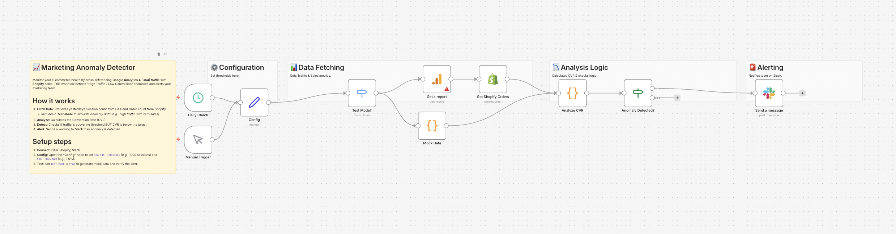

# 📈 04 - Marketing Anomaly Detector（AIマーケティング異常検知ボット）

## 💡 概要 (Overview)
**「ダッシュボードを睨みつける毎朝の作業、もう終わりにしませんか？」**

Marketing Anomaly Detectorは、Google Analytics（GA4）や各種広告プラットフォームの数値を定期的に取得し、AI（Gemini）が「普段と違う異常な動き（スパイクや急落）」を検知した場合のみ、アラートを通知するn8nワークフローです。

単なる「しきい値超え」の通知ではなく、AIが「なぜこの異常が起きたのか？（例：特定のSNSで拡散されている可能性、広告のCPAが高騰している等）」の仮説を添えて報告してくれるため、すぐに対策を打つことができます。

## 🎯 解決する課題 (Pain Points)
* 毎朝、複数の管理画面（GA4、Meta広告、Google広告など）を開いて数値を転記・確認するのに時間を奪われている。
* 気づかないうちに広告のCPAが高騰し、無駄な予算を消化してしまう（予算の出血）。
* 突然アクセスが跳ねた（バズった）ことに気づくのが遅れ、販売の機会損失やサーバーダウンを招いてしまう。

## ⚙️ ワークフローの仕組み (How it Works)

1. **定期実行:** `Schedule Trigger` ノードにより、毎朝（または数時間おきに）ワークフローが起動します。
2. **データ取得:** HTTP Requestノードや専用ノードを使って、GA4や広告APIから最新のKPI（PV、CVR、CPAなど）を取得します。
3. **AI異常検知:** 過去の平均値データと共に最新データを `Gemini` ノードに渡し、「これは異常な変動か？ その理由は何か？」を推論させます。
4. **アラート通知:** 異常が検知された場合のみ、Slack等の指定チャンネルに「⚠️ 異常検知」として、AIの考察コメント付きで通知します。

## 🚀 使い方 (How to Use)
1. このリポジトリ内の `workflow.json` をダウンロードします。
2. ご自身のn8n環境を開き、ワークフロー画面で「Import from File」を選択して読み込みます。
3. データを取得したいツール（GA4など）のAPI連携設定を行います。
4. `Gemini` ノードにAPIキーを設定し、監視したい重要指標（KPI）の条件をプロンプトで微調整してください。

## 💡 カスタマイズのヒント
* **ポジティブ/ネガティブの切り分け:** 異常検知の条件を分岐させ、アクセス急増（ポジティブ）の場合は「🚀 チャンス到来！」として営業チームへ、CPA高騰（ネガティブ）の場合は「🚨 予算超過アラート」としてマーケチームへ通知先を分けることができます。
* **デイリーサマリーへの転用:** 異常がない日でも、数値を要約して「本日は異常なし。昨日のサマリーです」と一言添えた日報ボットとして活用することも可能です。

---
**Created by [Alternative Computers](https://alternativecomputers.org/)** Webマーケティングの数値管理の自動化や、データ活用体制の構築でお悩みの方は、有限会社野田収一事務所までお気軽にお声がけください。
