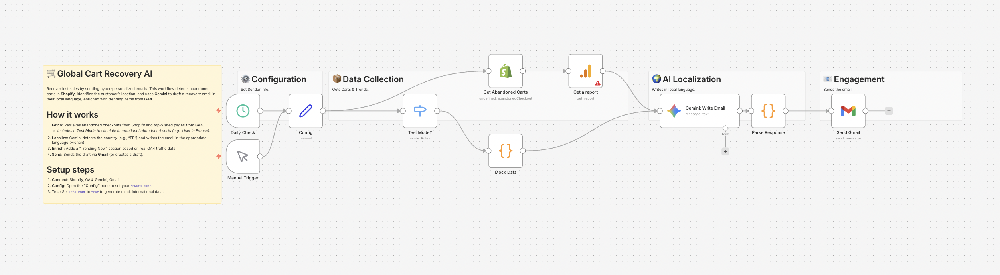

# Global Cart Recovery with Localized Emails 🛒🌍

## Overview
**Win back international customers with AI-localized emails.**
This workflow helps you recover lost sales by sending hyper-personalized abandoned cart emails. It detects the customer's country from **Shopify**, uses **Gemini** to translate the message into their local language, and even appends trending product recommendations from **Google Analytics 4 (GA4)** data.

## Key Features
- **🌐 AI Localization:** Gemini automatically detects the country code (e.g., "FR") and drafts the email in the correct language (French).
- **💡 Dynamic Enrichment:** Inserts real-time "Trending Now" items from your GA4 data to encourage re-engagement.
- **🧪 Built-in Test Mode:** Simulates an international customer scenario (e.g., a French user abandoning a cart) to verify localization logic instantly.

## How It Works
1. **Fetch:** Retrieves abandoned checkouts from Shopify and top-visited pages from GA4.
2. **Localize:** Gemini analyzes the customer's location and drafts the email subject and body.
3. **Enrich:** Adds a personalized recommendation based on site trends.
4. **Send:** Dispatches the email via Gmail.

## Setup Steps
1. **Import:** Import `workflow.json` into n8n.
2. **Credentials:** Set up credentials for Shopify, GA4, Gemini, and Gmail.
3. **Config:**
   - Open the **"Config"** node.
   - Set your `SENDER_NAME`.
   - Set `TEST_MODE` to `true` to generate mock data.

## Requirements
- n8n v1.x or later
- Google Gemini API Key
- Shopify & GA4 Access
