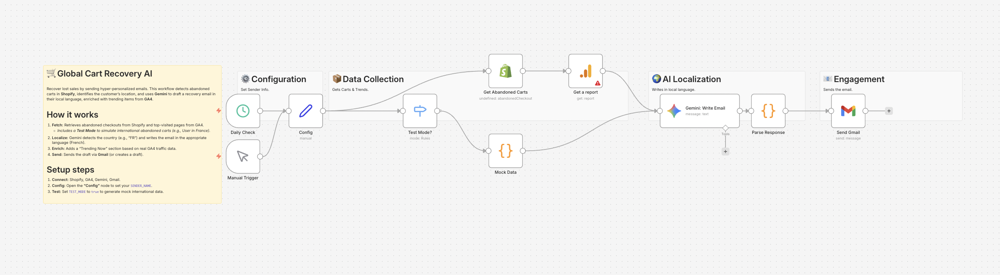

# 🛒 05 - Global Cart Recovery（AI多言語・カゴ落ちリカバリーボット）

## 💡 概要 (Overview)
**「言語の壁を超えて、取りこぼした売上をAIが回収します。」**

Global Cart Recoveryは、ECサイトで発生する「カゴ落ち（カートに商品を入れたまま離脱すること）」を検知し、AI（Gemini）が顧客の言語やカート内の商品に合わせてパーソナライズされたフォローアップメッセージを生成・送信するn8nワークフローです。

誰にでも同じ文章を送る従来のステップメールとは異なり、「なぜその商品がおすすめなのか」を相手の母国語で温かく伝えることで、劇的なコンバージョン（購入）の復帰率を実現します。

## 🎯 解決する課題 (Pain Points)
* ECサイトの売上の約7割と言われる「カゴ落ち」による膨大な機会損失。
* 一律の「買い忘れはありませんか？」という機械的な自動送信メールは、顧客の心に響かず無視されてしまう。
* 越境EC（海外販売）において、現地の言語や時差に合わせたきめ細やかなフォローアップがリソース不足でできない。

## ⚙️ ワークフローの仕組み (How it Works)

1. **カゴ落ち検知:** ShopifyやWooCommerceなどのECプラットフォームから、「カート放棄」のWebhookイベントを受け取ります。
2. **AI翻訳＆パーソナライズ:** 顧客の居住国（IPや住所）データとカート内の商品情報を `Gemini` ノードに渡します。AIが相手の母国語で、商品の魅力を交えた自然なフォローメッセージを生成します。
3. **時差考慮（オプション）:** 顧客のタイムゾーンを判定し、真夜中を避けて「最も読まれやすい時間帯」まで送信を待機（Waitノード）します。
4. **自動送信:** Gmail、SendGrid、またはTwilio（SMS）を通じて、生成されたメッセージを送信します。

## 🚀 使い方 (How to Use)
1. このリポジトリ内の `workflow.json` をダウンロードします。
2. ご自身のn8n環境を開き、ワークフロー画面で「Import from File」を選択して読み込みます。
3. トリガーとなるECサイト（Shopify等）のWebhook設定を行います。
4. `Gemini` ノードにAPIキーを設定し、メール送信ノード（SendGridやGmail等）の認証を済ませてください。

## 💡 カスタマイズのヒント
* **ダイナミック・ディスカウント:** カート内の合計金額が一定額以上の場合のみ、AIへのプロンプト指示で「10%OFFの特別クーポンコード」を文面に忍ばせるよう条件分岐させると、リカバリー率がさらに跳ね上がります。
* **ABテストの自動化:** AIに「情熱的なトーン」と「控えめで丁寧なトーン」の2パターンの文章を作らせ、ランダムで振り分けて送信することで、どのトーンが最も購入に繋がるかのデータを蓄積できます。

---
**Created by [Alternative Computers](https://alternativecomputers.org/)** ECサイトの売上回復施策や、顧客対応の多言語化・自動化でお悩みの方は、有限会社野田収一事務所までお気軽にお声がけください。
