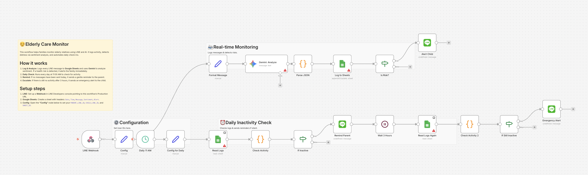

# Elderly Care Monitor (LINE & Gemini) 👵🤖

## Overview
**Ensure the safety of elderly family members living alone.**
This workflow was designed to monitor daily communications via **LINE**. It uses **Gemini (AI)** to analyze the sentiment of messages for distress signals (e.g., "I feel dizzy") and logs health updates to **Google Sheets**. If an emergency is detected or inactivity persists, it alerts family members instantly.

*Note: This workflow was previously approved for the official n8n template library.*

## Key Features
- **🚨 AI Distress Detection:** Gemini analyzes messages not just for keywords, but for sentiment (Emergency vs. Routine).
- **📝 Health Logging:** Automatically archives daily messages and health status to Google Sheets for long-term monitoring.
- **🧪 Built-in Test Mode:** Includes a simulation mode to trigger "Emergency" alerts without needing to send actual LINE messages.

## How It Works
1. **Monitor:** Listens for incoming messages from the elderly person's LINE account.
2. **Analyze:** Gemini evaluates the text to determine the safety status (Positive/Negative/Emergency).
3. **Action:**
   - **Normal:** Logs the status to Google Sheets.
   - **Emergency:** Sends an immediate email alert to family members.

## Setup Steps
1. **Import:** Import `workflow.json` into n8n.
2. **Credentials:** Set up LINE Notify (or Messaging API), Gemini, Google Sheets, and Gmail.
3. **Config:**
   - Open the **"Config"** node.
   - Set `ALERT_EMAIL` and `SHEET_ID`.
   - Set `TEST_MODE` to `true` to verify the emergency alert logic.

## Requirements
- n8n v1.x or later
- LINE Account (Messaging API)
- Google Gemini API Key
