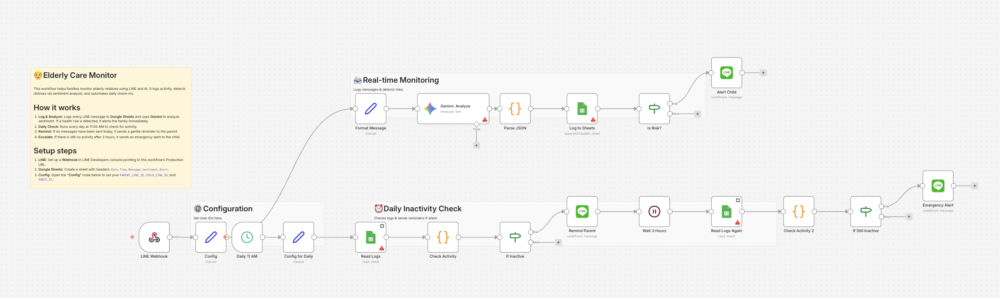

# 👵👴 06 - Elderly Care Monitor（AI×IoT 高齢者見守りボット）

## 💡 概要 (Overview)
**「『見張る』のではなく『見守る』。プライバシーを守りながら、遠くの家族に安心を。」**

Elderly Care Monitorは、スマートホーム機器（温湿度センサー、ドア開閉センサー、スマートプラグ等）から取得した生活データをAI（Gemini）が分析し、離れて暮らす高齢者の「生活リズムの危険な変化」を察知して家族に通知するn8nワークフローです。

監視カメラのような心理的抵抗感を与えず、「真夏に室内が35度を超えているのにエアコンが稼働していない」「24時間以上、トイレのドアが開閉されていない」といった『声なきSOS』をAIが推論し、手遅れになる前のアクションを促します。

## 🎯 解決する課題 (Pain Points)
* 離れて暮らす親の安否が常に心配だが、毎日電話で確認するのはお互いに精神的な負担になる。
* リビングに監視カメラを設置することを提案したが、「監視されているようで嫌だ」と拒絶されてしまった。
* 「連絡がないのは元気な証拠」と思い込みたいが、熱中症や室内での転倒など、突発的なトラブルへの恐怖が拭えない。

## ⚙️ ワークフローの仕組み (How it Works)

1. **IoTデータ取得:** `Schedule Trigger` ノードを起点に、SwitchBotやSmartThingsなどのIoTプラットフォームのAPIを定期的に叩き、センサー情報（室温、ドア開閉履歴、家電の電力使用量など）を取得します。
2. **AI状況推論:** 取得したデータを `Gemini` ノードに渡し、「現在の状況は高齢者の健康にとって危険（または異常）ではないか？」を推論させます。
3. **条件分岐:** AIが「異常あり（アラートが必要）」と判断した場合のみ、次のステップへ進みます。
4. **家族へ通知:** 家族のLINEやSlack、SMSなどに「異常の可能性とその理由（例：室温異常のため熱中症の危険あり）」を即座に通知します。

## 🚀 使い方 (How to Use)
1. このリポジトリ内の `workflow.json` をダウンロードします。
2. ご自身のn8n環境を開き、ワークフロー画面で「Import from File」を選択して読み込みます。
3. `HTTP Request` ノード等に、ご使用のIoTデバイス（SwitchBot API等）の認証情報を設定します。
4. `Gemini` ノードにAPIキーを設定し、親御さんの基礎疾患や普段の起床時間などをプロンプトに加味して推論精度を上げてください。

## 💡 カスタマイズのヒント
* **Twilio連携による緊急コール:** 緊急度が「高（例：丸1日動きがない）」と判定された場合、家族のスマホに直接自動音声で電話をかける `Twilio` ノードを追加すると、深夜でも確実な初動対応が可能になります。
* **朝の「おはよう」自動化:** 毎朝、電気ケトルやテレビの電源が入った（＝起きて活動を始めた）ことをトリガーに、「今日も無事に起きました」という安心メッセージだけを家族のLINEにそっと送る機能も簡単に実装できます。

---
**Created by [Alternative Computers](https://alternativecomputers.org/)** IoTを活用した見守りシステムの構築や、自治体・介護事業者向けの業務自動化支援については、有限会社野田収一事務所までお気軽にご相談ください。
