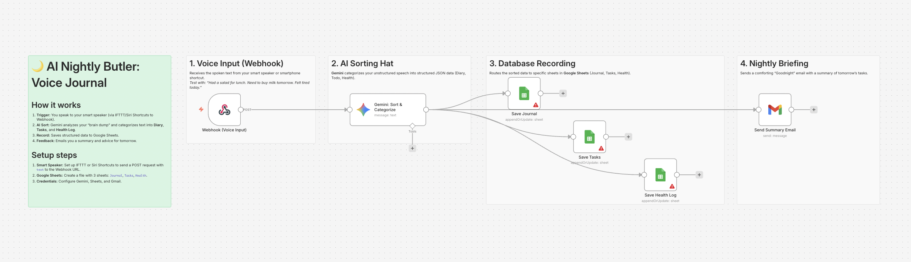

# AI Nightly Butler: Voice Journal 🌙

## Overview
**Speak your mind before bed, and let AI organize your life.**
This workflow turns your n8n into a personal butler. Just speak into your phone (using Siri/IFTTT to Webhook), and **Gemini (AI)** will listen to your "brain dump." It automatically sorts your words into a **Diary** entry, a list of **Tasks** for tomorrow, and a **Health** log. Finally, it sends you a polite "Goodnight" email summary.

## Key Features
- **🗣️ Voice-to-Action:** Designed to accept text transcripts from voice assistants via Webhook.
- **🎩 AI Sorting Hat:** Gemini intelligently parses unstructured speech into structured categories (Diary, Tasks, Health).
- **📝 Multi-Sheet Logging:** Automatically saves data to three different tabs in Google Sheets.
- **🧪 Built-in Test Mode:** Simulates a voice entry (e.g., *"Had a salad, remind me to buy milk..."*) to test the categorization logic instantly.

## How It Works
1. **Input:** You trigger the Webhook with text (e.g., via iOS Shortcuts or IFTTT).
2. **Sort:** Gemini analyzes the text and extracts key information.
3. **Record:** - Adds narrative text to the **Journal** sheet.
   - Extracts action items to the **Tasks** sheet.
   - Logs health-related info to the **Health** sheet.
4. **Briefing:** Sends a summary email to confirm everything is recorded.

## Setup Steps
1. **Import:** Import `workflow.json` into n8n.
2. **Credentials:** Set up Gemini, Google Sheets, and Gmail.
3. **Google Sheets:** Create a file with 3 sheets: `Journal`, `Tasks`, `Health`.
4. **Config:** - Open **"Config"** to set `USER_EMAIL` and `SHEET_ID`.
   - Set `TEST_MODE` to `true` to generate mock voice data.

## Requirements
- n8n v1.x or later
- Google Gemini API Key
- (Optional) IFTTT or Siri Shortcuts for voice input
