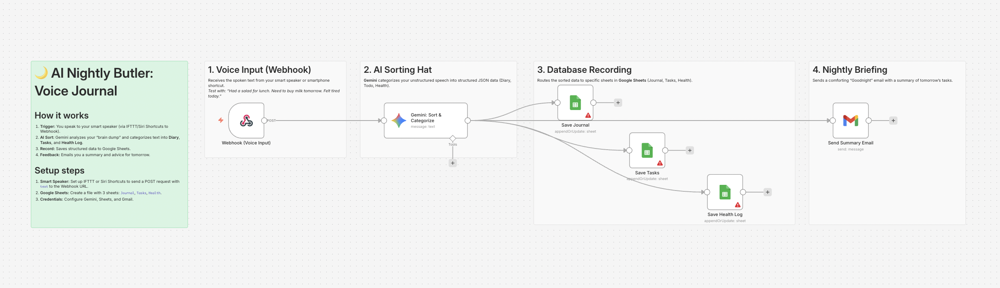

# 🌙 07 - AI Nightly Butler（AI専属・夜間執事ボット）

## 💡 概要 (Overview)
**「明日の不安をAIに預けて、今夜はぐっすり眠りませんか？」**

AI Nightly Butlerは、毎晩決まった時間に明日のスケジュール、天気予報、そして未完了のタスクを収集し、AI（Gemini）が優秀な執事のように「明日の準備レポート」として優しくまとめて報告してくれるn8nワークフローです。

「明日は何から始めればいいか」を寝る前にクリアにすることで、脳のバックグラウンドで動き続ける不安をストップさせ、質の高い睡眠とスムーズな翌朝のスタートをサポートします。

## 🎯 解決する課題 (Pain Points)
* 布団に入ってから「明日の最初の予定は何だっけ？」「傘はいる？」と不安になり、スマホを触って目が冴えてしまう。
* 毎日タスクに追われており、「1日が終わった（仕事のスイッチを切る）」という明確な区切りがない。
* 翌朝起きてからその日のスケジュールを確認するため、常に後手後手で1日が始まってしまう。

## ⚙️ ワークフローの仕組み (How it Works)

1. **定期実行:** `Schedule Trigger` ノードにより、毎晩就寝前の時間帯（例：21:30）に起動します。
2. **情報収集:** Google Calendar（明日の予定）、OpenWeatherMap等（明日の天気）、NotionやTodoist（残タスク）からデータを自動でかき集めます。
3. **AIによる執事レポート生成:** 収集したデータを `Gemini` ノードに渡し、「優秀で思いやりのある専属執事」として、明日のハイライトやアドバイス（例：明日は午後から雨なので傘をお忘れなく）を含めた温かいメッセージを生成させます。
4. **おやすみ通知:** LINEやSlackなど、あなたが一番リラックスして見られるプライベートな空間にレポートを送信します。

## 🚀 使い方 (How to Use)
1. このリポジトリ内の `workflow.json` をダウンロードします。
2. ご自身のn8n環境を開き、ワークフロー画面で「Import from File」を選択して読み込みます。
3. Google Calendarや天気API（OpenWeatherMapなど）、タスク管理ツールの各ノードに認証情報を設定します。
4. `Gemini` ノードにAPIキーを設定し、通知先（LINE Notify等）のトークンを設定してください。

## 💡 カスタマイズのヒント
* **トーン＆マナーの変更:** AIへのプロンプト設定で、口調を「厳格なコーチ」や「癒やし系のキャラクター」に変更することで、自分好みのメンターに育てることができます。
* **振り返りジャーナル機能の追加:** 「今日あった良かったことを1つ教えてください」という質問を投げかけるステップを追加し、返答をNotionなどに蓄積していくと、自己肯定感を高める自動日記ツールとしても機能します。

---
**Created by [Alternative Computers](https://alternativecomputers.org/)** 従業員のメンタルヘルスケアを支える社内DXや、業務の自動化・効率化についてのご相談は、有限会社野田収一事務所までお気軽にお声がけください。
