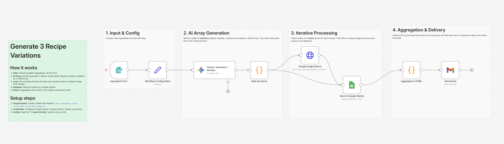

# Lazy Chef: AI Recipe Generator 🍳

## Overview
**Turn fridge leftovers into a gourmet feast.**
Don't know what to cook? Just enter the ingredients you have (e.g., "Eggs, Milk, Old Bread") into the form. This workflow uses **Gemini (AI)** to dream up 3 distinct recipe variations: **Speed** (fast), **Healthy** (light), and **Creative** (unexpected). It even searches **Google Images** to show you what the final dish could look like, then sends you a beautiful menu via email.

## Key Features
- **👨‍🍳 3-Style Generation:** Doesn't just give one recipe; it offers choices based on your mood (Speed/Healthy/Creative).
- **🖼️ Visual Enrichment:** Automatically fetches appetizing images from Google Search to make the email menu pop.
- **🧪 Built-in Test Mode:** Simulates an input of "Eggs, Milk, Tomato" to demonstrate the generation and email delivery instantly.

## How It Works
1. **Input:** You submit ingredients via an n8n Form (or use Test Mode).
2. **Generate:** Gemini acts as a master chef, creating 3 unique recipes from the same ingredients.
3. **Visualize:** The workflow loops through each recipe and finds a matching image via Google Custom Search API.
4. **Deliver:** Aggregates all 3 options into a single HTML email and logs them to Google Sheets.

## Setup Steps
1. **Import:** Import `workflow.json` into n8n.
2. **Credentials:** Set up Gemini, Google Custom Search, Sheets, and Gmail.
3. **Google Sheets:** Create a file with columns: `date`, `style`, `recipe_name`, `image_url`.
4. **Config:** - Open **"Config"** to set your API Keys and Sheet ID.
   - Set `TEST_MODE` to `true` to run a simulation.

## Requirements
- n8n v1.x or later
- Google Gemini API Key
- Google Custom Search API (with Image search enabled)
