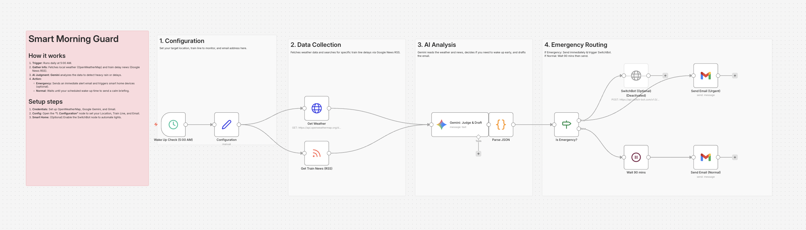

# Smart Morning Guard: Weather & Train AI Alert 🌅

## Overview
**Wake up prepared, not panicked.**
This workflow runs every morning at 5:00 AM (or your preferred time). It fetches the latest local **Weather** via OpenWeatherMap and checks **Train Delay** news via Google News RSS.

**Google Gemini (AI)** analyzes this combined data. If it detects a "Morning Emergency" (e.g., Heavy Typhoon, Train Suspension), it sends you an **immediate alert email** to wake you up early. If everything is normal, it waits and sends a calm daily briefing later.

## Key Features
- **🧠 AI Context Analysis:** Uses Gemini to judge severity. It knows that "Light Rain" is normal, but "Heavy Storm" is an emergency.
- **📡 Multi-Source Data:** Combines Weather API data and News RSS feeds into a single context for the AI.
- **🧪 Built-in Test Mode:** Simulates a "Heavy Thunderstorm & Train Suspension" scenario to verify the emergency alert logic instantly.

## How It Works
1. **Trigger:** Runs on a schedule or via Manual Trigger.
2. **Fetch:** Gets weather data and searches specifically for delays on your target train line.
3. **Judge:** AI decides: "Do I need to wake the user up NOW?"
4. **Action:**
   - **Emergency:** Sends urgent email (can also trigger SwitchBot/IoT devices).
   - **Normal:** Waits 90 minutes (or until wake-up time) to send a standard briefing.

## Setup Steps
1. **Import:** Import `workflow.json` into n8n.
2. **Credentials:** Set up OpenWeatherMap, Gemini, and Gmail.
3. **Config:**
   - Open **"Config"** to set your `LOCATION` (e.g., Tokyo,JP) and `TRAIN_LINE` (e.g., Yamanote Line).
   - Set `TEST_MODE` to `true` to generate mock emergency data.

## Requirements
- n8n v1.x or later
- OpenWeatherMap API Key (Free)
- Google Gemini API Key
