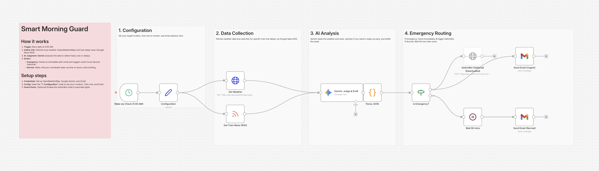

# 🛡️ 09 - Smart Morning Guard（AI先回り・朝の危機回避ボット）

## 💡 概要 (Overview)
**「朝の絶望を、あなたが目覚める前に回避します。」**

Smart Morning Guardは、あなたが起床する少し前に自動で起動し、その日の天気予報、利用する路線の運行情報、そして朝イチのスケジュールをAI（Gemini）が総合的にチェックするn8nワークフローです。

もし「大雨の予報」や「電車の運転見合わせ」などのトラブルを検知した場合は、「いつもより15分早く家を出る必要があります」といった警告（エマージェンシー・アラート）を出し、あなたの朝の危機を先回りで防ぎます。

## 🎯 解決する課題 (Pain Points)
* 駅の改札に着いてから「運転見合わせ」の表示を見て、絶望とともに迂回ルートを検索する羽目になる。
* 晴れていると思って家を出たらゲリラ豪雨に遭い、朝からスーツが濡れて1日のモチベーションが底をつく。
* 朝の想定外のトラブルのせいで、絶対に遅刻できない重要な会議に間に合わなくなる恐怖。

## ⚙️ ワークフローの仕組み (How it Works)

1. **早朝の自動起動:** `Schedule Trigger` ノードにより、あなたの起床時間の少し前（例：朝6:00）に稼働します。
2. **外部データの収集:** OpenWeatherMap（天気）、鉄道会社のAPIやRSS（運行情報）、Google Calendar（今日の予定）から最新の状況を取得します。
3. **AIによる危機判定:** 収集したデータを `Gemini` ノードが分析し、「今日は通常通りの朝か、それとも警戒が必要な朝か」を判定します。
4. **スマート通知:** 異常がなければ「おはようございます。今日は快晴、電車も平常運転です」と穏やかに通知し、遅延などがある場合は「⚠️警告：〇〇線で遅延が発生しています。迂回ルートの検討をおすすめします」とLINEやSlackへ緊急通知を送ります。

## 🚀 使い方 (How to Use)
1. このリポジトリ内の `workflow.json` をダウンロードします。
2. ご自身のn8n環境を開き、ワークフロー画面で「Import from File」を選択して読み込みます。
3. 天気API、運行情報のRSSフィード、カレンダー等、情報収集元のノードを設定します。
4. `Gemini` ノードにAPIキーを設定し、通知先（LINE NotifyやSlack等）の認証を行ってください。

## 💡 カスタマイズのヒント
* **スマートホームとの連動:** 危機判定が「高（電車遅延など）」の場合のみ、SwitchBotなどのAPIを叩いて「寝室の電気を強制的に15分早く全開にする」という荒療治な起床システムに発展させることができます。
* **代替ルートの自動提案:** 運行情報で遅延を検知した場合、AIへのプロンプトで「〇〇駅から△△駅までの代替の乗換ルートを3つ提案して」と指示を追加しておけば、起きてすぐに行動を移せます。

---
**Created by [Alternative Computers](https://alternativecomputers.org/)** 日々のトラブルを未然に防ぐパーソナル自動化から、企業向けのリスク管理DXまで、有限会社野田収一事務所へお気軽にご相談ください。
