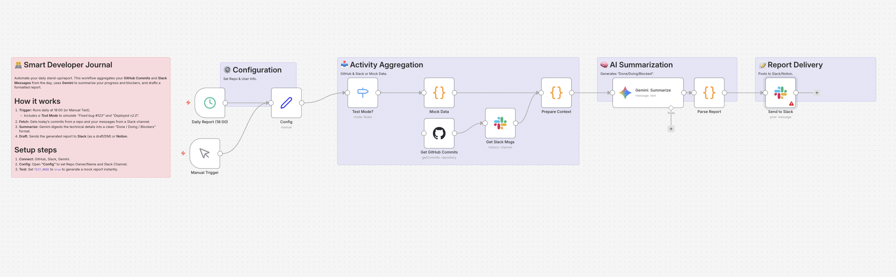

# 💻 10 - Smart Developer Journal（AI完全自動・開発日報ボット）

## 💡 概要 (Overview)
**「あなたはコードを書くだけ。日報はAIが書き上げます。」**

Smart Developer Journalは、エンジニアの1日の活動履歴（GitHubのコミット履歴や、Jira/Trelloのタスク消化状況など）を自動でかき集め、AI（Gemini）が「今日何をして、どこで詰まり、明日は何をするか」というプロフェッショナルな日報（ジャーナル）を自動生成するn8nワークフローです。

1日中コードを書いて疲れ果てた脳で、さらに文章を捻り出す苦痛の時間を「ゼロ秒」にします。

## 🎯 解決する課題 (Pain Points)
* 退勤間際の最も疲れている時間帯に、「今日何やったっけ…」と思い出しながら日報を書くのが純粋に苦痛。
* コミットメッセージやタスク管理ツールに記録は残しているのに、それをわざわざ「日報」という別のフォーマットにコピペして清書する二度手間。
* 報告業務（ドキュメント作成）に時間を取られ、肝心の開発（コーディング）に集中しきれない。

## ⚙️ ワークフローの仕組み (How it Works)

1. **夕方の自動起動:** `Schedule Trigger` ノードにより、毎日の退勤時間（例：18:30）に起動します。
2. **活動履歴の収集:** GitHubのAPIから「今日のコミット履歴とPR」、NotionやJiraから「今日完了したタスク」のデータを抽出します。
3. **AIによる日報生成:** 収集した生のログデータを `Gemini` ノードに渡し、「やったこと」「直面した課題」「明日の予定」のフォーマットに沿った、人間が読んですぐ理解できる自然な文章に要約・翻訳させます。
4. **自動提出・記録:** チームのSlack（日報チャンネル）への自動投稿や、個人のNotionデータベースへのアーカイブを自動で行います。

## 🚀 使い方 (How to Use)
1. このリポジトリ内の `workflow.json` をダウンロードします。
2. ご自身のn8n環境を開き、ワークフロー画面で「Import from File」を選択して読み込みます。
3. `GitHub` ノードやタスク管理ツール（Notion, Jira等）のAPI認証を設定し、データ取得元のリポジトリ/プロジェクトを指定します。
4. `Gemini` ノードにAPIキーを設定し、出力先のSlackチャンネルやNotionデータベースを指定してください。

## 💡 カスタマイズのヒント
* **「今日のハイライト」の自動抽出:** AIへのプロンプトで「一番コードの変更量が多かった部分を『今日のハイライト』として面白く紹介して」と指示すると、無味乾燥な日報がチームの話題をさらうコンテンツに変わります。
* **感情の記録（エモ・ジャーナル）:** 日報生成の直前に、Slackボットから「今日一番辛かったバグは何？」と短い質問を投げかけ、その回答（愚痴）を日報の「所感」としてAIに美しく書き直して組み込ませることも可能です。

---
**Created by [Alternative Computers](https://alternativecomputers.org/)** 開発チームの生産性向上や、エンジニアを「開発以外の雑務」から解放するDX支援については、有限会社野田収一事務所までお気軽にご相談ください。
