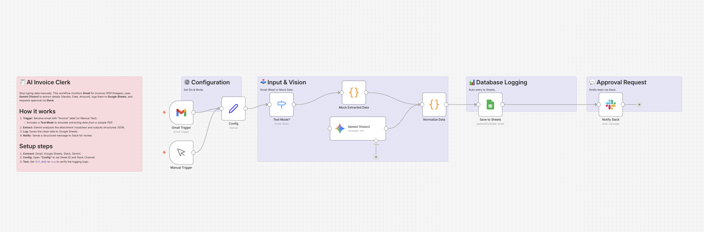

# AI Invoice Clerk: Gmail Attachment Processor 🧾

## Overview
**Stop typing invoice data manually.**
This workflow acts as your personal accounting assistant. It monitors your **Gmail** for incoming invoices (PDFs or Images), uses **Google Gemini (Vision)** to read the file and extract key details (Vendor, Date, Amount), and automatically logs them into **Google Sheets**. Finally, it sends a notification to **Slack** for approval.

## Key Features
- **👀 AI Vision Extraction:** Uses Gemini's multimodal capabilities to "read" PDFs and images without complex OCR templates.
- **📊 Structured Logging:** Converts messy email attachments into clean, structured data in Google Sheets.
- **🧪 Built-in Test Mode:** Simulates the extraction result (e.g., an AWS invoice for $120.50), allowing you to test the Sheets and Slack integration without sending a real email.

## How It Works
1. **Trigger:** Detects a new email with an attachment (filtered by subject "Invoice" or "Bill").
2. **Extract:** Gemini scans the attachment and identifies the Vendor, Date, Total Amount, and Invoice ID.
3. **Log:** Adds a new row to your "Invoices" spreadsheet.
4. **Notify:** Posts a summary to Slack ("New Invoice from AWS: $120.50").

## Setup Steps
1. **Import:** Import `workflow.json` into n8n.
2. **Credentials:** Set up Gmail, Google Sheets, Slack, and Gemini.
3. **Google Sheets:** Create a sheet named `Invoices` with columns: `Received`, `Vendor`, `Date`, `Amount`, `Invoice ID`, `Summary`, `Status`.
4. **Config:**
   - Open **"Config"** to set `SHEET_ID` and `SLACK_CHANNEL`.
   - Set `TEST_MODE` to `true` to verify the logic with mock data.

## Requirements
- n8n v1.x or later
- Google Gemini API Key
- Gmail Account
