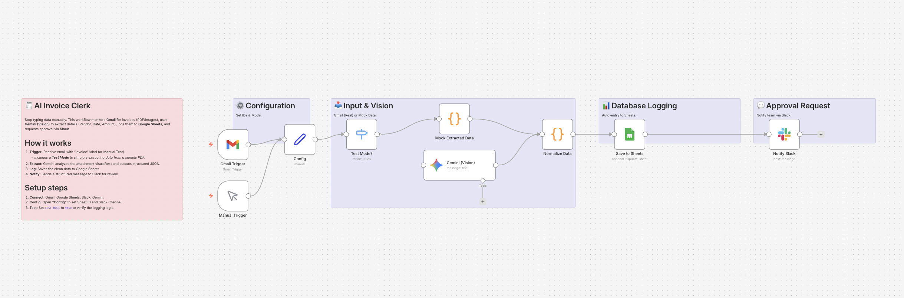

# 🤖 n8n-workflow #11: AI Invoice Clerk
> **「入力作業」を捨て、「確認ボタン」を押すだけの情シス・経理へ。**

毎月届くバラバラな形式の請求書。手入力の苦痛と、インボイス登録番号の照合という「地味に胃が痛む作業」を、AI（Gemini）とn8nが完全に代行します。

## 🌟 このワークフローで解決すること
- **バラバラなフォーマットからの解放**: PDF、写真、スキャンデータ。どんな形式でもAIが文脈を読み取ります。
- **「登録番号」の強迫観念からの脱却**: インボイス登録番号の形式チェックと、税計算の整合性をAIがダブルチェック。
- **「OCRは信用できない」という不信感の払拭**: AIが解析し、人間はSlackに届く「最終確認ボタン」を押すだけ。

## 🛠 主な機能
1. **マルチトリガー**: メール添付、またはGoogleドライブへの保存を検知して自動起動。
2. **インテリジェント抽出**: Gemini 1.5 Flashを使用し、発行元・登録番号・日付・各金額を正確に構造化。
3. **ロジックバリデーション**: 「税抜 + 消費税 = 合計」が合っているか、AIによる論理チェックを実行。
4. **自動記帳連携**: GoogleスプレッドシートやNotion等へデータを自動転送（カスタマイズ可能）。
5. **人間中心のフロー**: 処理結果をSlackで通知。人間が「承認」するまで本番反映を待機させる安全設計。

## 🏗 セットアップ方法
1. **n8nへのインポート**: `ai-invoice-clerk.json` をワークフロー画面にドラッグ＆ドロップ。
2. **APIキーの設定**:
   - Google AI Studio (Gemini API)
   - Slack Webhook (またはBot Token)
   - Google Drive / Gmail 連携
3. **環境変数**: スプレッドシートのIDや保存先フォルダを指定してください。

---
Produced by [有限会社野田収一事務所](https://alternativecomputers.org/)

「現場の時間を、クリエイティブな時間へ。」

