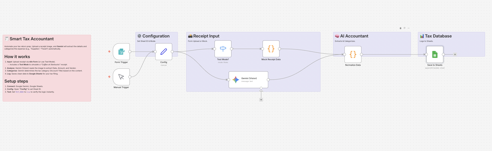

# Smart Tax Accountant: Receipt Auto-Categorizer 🧾

## Overview
**Automate your tax return (Kakutei Shinkoku) preparation.**
This workflow is a lifesaver for freelancers and small business owners during tax season. Simply upload a photo of a receipt via the n8n Form, and **Google Gemini** will extract the key details (Date, Amount, Vendor) and automatically determine the correct **Tax Account Title (勘定科目)** (e.g., Supplies, Travel, Meeting Expenses).

## Key Features
- **🧠 AI Categorization:** Gemini acts as a bookkeeper, classifying expenses into Japanese tax categories like "消耗品費" or "会議費" based on context.
- **📸 Vision to Data:** Extracts text from receipt images without manual typing.
- **🧪 Built-in Test Mode:** Simulates a "Starbucks" receipt to verify the categorization logic and Sheets integration instantly.

## How It Works
1. **Input:** You upload a receipt image via the provided n8n Form URL.
2. **Analyze:** Gemini (Vision) scans the image for data.
3. **Categorize:** The AI decides the appropriate tax category (Account Title).
4. **Log:** Automatically appends a row to your Google Sheet for tax filing.

## Setup Steps
1. **Import:** Import `workflow.json` into n8n.
2. **Credentials:** Set up Google Gemini and Google Sheets.
3. **Google Sheets:** Create a sheet named `Expenses` with columns: `Date`, `Vendor`, `Amount`, `Category`, `Memo`, `Logged At`.
4. **Config:**
   - Open **"Config"** to set `SHEET_ID`.
   - Set `TEST_MODE` to `true` to test with mock data.

## Requirements
- n8n v1.x or later
- Google Gemini API Key
- Google Sheets
