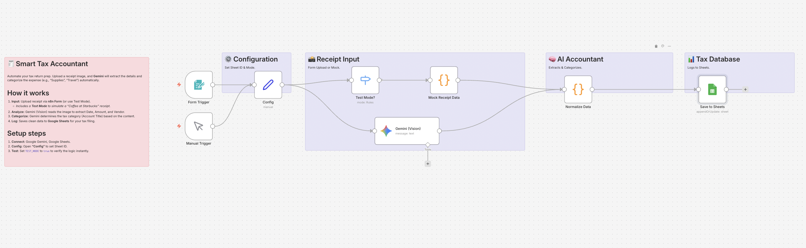

# 🧙‍♂️ n8n-workflow #12: Smart Tax Accountant
> **「これ、経費で落ちますか？」の迷いをゼロにする、AI搭載型・自動仕訳システム。**

確定申告や月次決算のたびに訪れる「領収書の山」と「勘定科目の悩み」。

Smart Tax Accountantは、AI（Gemini）があなたのビジネス文脈を理解し、領収書から最適な仕訳データを生成。確認ボタン一つで会計台帳（スプレッドシート/Notion）へ記録します。

## 🌟 このワークフローで解決すること
- **勘定科目の「当て推量」を廃止**: AIが内容を解析し、適切な勘定科目を根拠とともに提案。
- **インボイス制度への完全対応**: 適格請求書発行事業者の番号チェックと、税率ごとの自動計算を完結。
- **週末の「領収書整理」を解放**: スマホで撮って送るだけ、またはドライブに入れるだけで即座にデータ化。

## 🛠 主な機能
1. **AIインテリジェント仕訳**: Gemini 1.5 Proが品目から「会議費」「旅費交通費」などを自動判定。
2. **証憑管理の自動化**: 読み取った領収書ファイルを、日付・支払先名でリネームしてGoogleドライブに自動整理。
3. **対話型インターフェース**: SlackやTelegramから「これは経費？」と相談しながら登録可能。
4. **会計ソフト連携準備**: そのままfreeeやマネーフォワードにインポート可能な形式でGoogleスプレッドシートに出力。

## 🏗 セットアップ方法
1. **n8nへのインポート**: `smart-tax-accountant.json` をインポートします。
2. **プロンプトのカスタマイズ**: `AI Agent` ノードにて、あなたの業種（例：ITコンサル、飲食店など）を設定すると、仕訳の精度が劇的に向上します。
3. **認証設定**: 
   - Google AI Studio (Gemini API キー)
   - Google Sheets / Drive 連携
   - 通知用ツール（Slack等）のWebhook

---
Produced by [有限会社野田収一事務所](https://alternativecomputers.org/)
「現場の『面倒』を、AIと一緒に『喜び』へ変える。」
