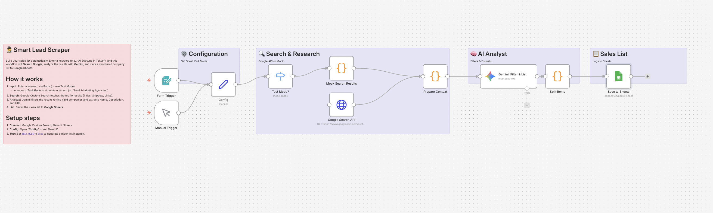

# Smart Lead Scraper: Keyword to Sales List 🕵️

## Overview
**Automate your market research and lead generation.**
Stop manually Googling and copy-pasting company details into spreadsheets. Just enter a keyword (e.g., "AI Startups in Tokyo") into the n8n Form, and this workflow will:
1. **Search Google** for relevant websites.
2. Use **Gemini (AI)** to analyze the search results, filter out irrelevant pages, and extract company summaries.
3. Automatically create a tidy **Sales List** in Google Sheets.

## Key Features
- **🔎 Automated Research:** Fetches real-time search results via Google Custom Search API.
- **🧠 AI Filtering:** Gemini intelligently distinguishes between "actual company sites" and "generic articles" or "job boards," keeping your list clean.
- **🧪 Built-in Test Mode:** Simulates a search for "SaaS Agencies" so you can verify the sheet logging without setting up the Google Search API immediately.

## How It Works
1. **Input:** Submit a keyword via the n8n Form.
2. **Search:** The workflow retrieves top search results (Titles, Snippets, Links).
3. **Analyze:** Gemini processes the search snippets to extract "Company Name", "Description", and "URL".
4. **Log:** Saves the structured data to Google Sheets.

## Setup Steps
1. **Import:** Import `workflow.json` into n8n.
2. **Credentials:** Set up Google Custom Search (API Key & Engine ID), Gemini, and Sheets.
3. **Google Sheets:** Create a sheet named `LeadList` with columns: `Company`, `Description`, `URL`, `Added At`.
4. **Config:**
   - Open **"Config"** to set your `SHEET_ID`, `GOOGLE_API_KEY`, and `SEARCH_ENGINE_ID`.
   - Set `TEST_MODE` to `true` to test with mock data.

## Requirements
- n8n v1.x or later
- Google Custom Search JSON API (Enabled in Google Cloud Console)
- Programmable Search Engine ID (from cse.google.com)
- Google Gemini API Key
