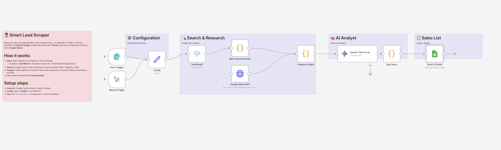

# 🚀 n8n-workflow #13: Smart Lead Scraper
> **「リスト作成」を卒業し、「商談」に集中する。AIがウェブからリードを自動発掘・分析。**

ターゲット企業のURLを渡すだけで、AI（Gemini）がサイト内容を読み解き、サービス内容、企業規模、さらには「自社製品との親和性」までを自動でレポート化します。

## 🌟 このワークフローで解決すること
- **果てしないコピペ作業の撲滅**: 会社概要、事業内容、問い合わせ先を1件ずつコピペする時間をゼロにします。
- **質の低いリードリストの排除**: AIが企業の強みを分析し、ターゲット外の企業を自動でフィルタリング。
- **パーソナライズされたアプローチ**: サイトの文脈から「なぜ自社が提案するのか」のフック（きっかけ）をAIが自動生成。

## 🛠 主な機能
1. **インテリジェント・スクレイピング**: 指定されたURLから主要なテキスト情報を自動取得。
2. **AI企業分析**: Geminiが「何をしている会社か」「どんな課題を抱えてそうか」を要約。
3. **リードスコアリング**: 自社のターゲット属性に合致するかをAIが判定し、優先順位を付与。
4. **CRM/スプレッドシート連携**: 抽出・分析されたデータを即座に管理台帳へ書き込み。

## 🏗 セットアップ方法
1. **n8nへのインポート**: `smart-lead-scraper.json` をインポートします。
2. **スクレイピングツールの設定**: ブラウザ操作用ノード（Puppeteer/HTTP Request等）を環境に合わせて調整。
3. **プロンプトの調整**: 
   - Geminiノードで「自社の理想の顧客像」を定義してください。
4. **APIキーの設定**:
   - Google AI Studio (Gemini API)
   - 出力先（Google Sheets / Notion等）の認証

---
Produced by [有限会社野田収一事務所](https://alternativecomputers.org/)
「泥臭いリサーチは、AIに任せる時代へ。」
