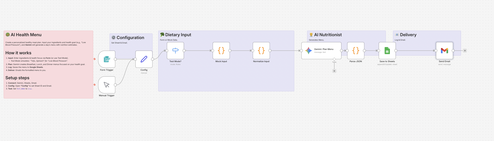

# 🥗 n8n-workflow #14: AI Health Menu
> **「何を食べればいいか」の迷いをゼロに。AIがあなたの体調と目標に寄り添うパーソナル献立生成システム。**

「最近、疲れが取れない」「ダイエットしたいが献立を考える余裕がない」
AI Health Menuは、あなたの健康状態や冷蔵庫の残り物、アレルギー情報を反映し、Geminiが「今、あなたに最適なメニュー」を提案。SlackやLINEに自動通知します。

## 🌟 このワークフローで解決すること
- **「決断疲れ」の解消**: 毎日3回訪れる「献立を考える」という知的リソースの浪費を防ぎます。
- **パフォーマンスの最大化**: 血糖値の急上昇を抑えるメニューや、集中力を高める食材をAIが論理的に提案。
- **健康経営の第一歩**: 社員がSlackで気軽に「今日の健康ランチ」を聞ける環境を構築し、組織全体のウェルビーイングを向上させます。

## 🛠 主な機能
1. **パーソナライズ抽出**: 性別、年齢、活動量、現在の体調（疲れ、筋肉痛など）を考慮。
2. **AI栄養士モード**: Geminiが単なる料理名だけでなく「なぜ今、この栄養素が必要か」の根拠を提示。
3. **柔軟な出力形式**: 買い物リストの自動生成や、付近の飲食店検索（API連携）への拡張が可能。
4. **マルチデバイス通知**: 毎朝決まった時間にSlackやスマホへ「今日の健康指針」を配信。

## 🏗 セットアップ方法
1. **n8nへのインポート**: `ai-health-menu.json` をインポートします。
2. **ユーザー情報の登録**: GoogleスプレッドシートやNotionに、あなたの「基本データ」や「避けたい食材」を記載。
3. **APIキーの設定**:
   - Google AI Studio (Gemini API)
   - 通知用ツール（Slack / Discord / LINE Notify等）

---
Produced by [有限会社野田収一事務所](https://alternativecomputers.org/)
「働く人の『体』も、DXで支えたい。」
