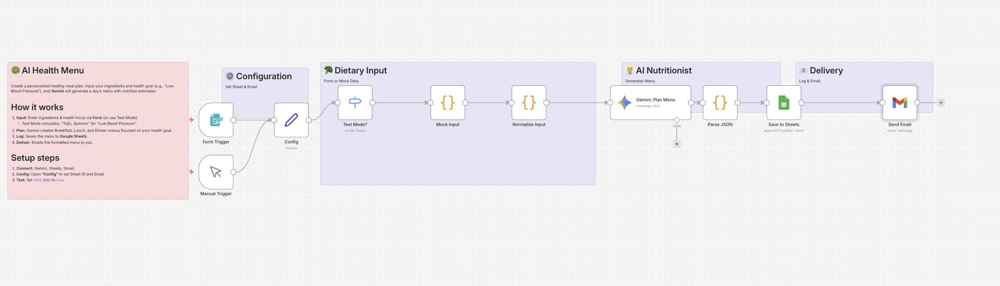

# AI Health Menu: Personalized Meal Planner 🥗

## Overview
**Your personal AI nutritionist.**
Targeted at users managing health conditions like high blood pressure or diabetes. Simply enter your available ingredients and your health goal (e.g., "Low Sodium", "High Protein"), and **Google Gemini** will generate a complete 1-day meal plan with nutritional estimates.

## Key Features
- **🩺 Health-Focused:** Customizes recipes based on specific goals (DASH diet, Keto, etc.).
- **🥘 Leftover Friendly:** Creates menus using ingredients you already have.
- **🧪 Built-in Test Mode:** Simulates a request for "Low Blood Pressure" menu using Tofu and Spinach.

## How It Works
1. **Input:** Submit ingredients & goal via n8n Form.
2. **Plan:** Gemini acts as a nutritionist to create a balanced Breakfast, Lunch, and Dinner menu.
3. **Log:** Saves the plan to Google Sheets for your health records.
4. **Deliver:** Emails you the menu with cooking advice.

## Setup Steps
1. **Import:** Import `workflow.json` into n8n.
2. **Credentials:** Set up Google Gemini, Sheets, and Gmail.
3. **Google Sheets:** Create a sheet named `MealLog` with columns: `Date`, `Goal`, `Breakfast`, `Lunch`, `Dinner`, `Advice`.
4. **Config:** Open **"Config"** to set `SHEET_ID` and `USER_EMAIL`.
