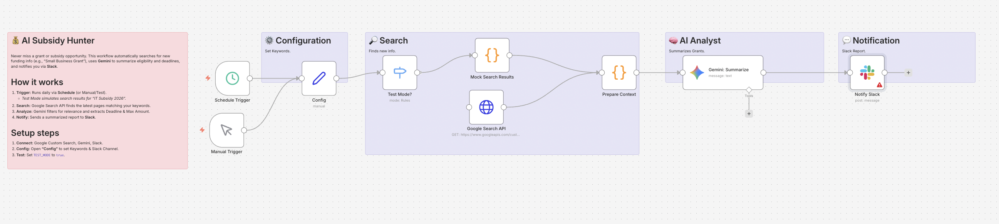

# AI Subsidy Hunter: Grant & Fund Tracker 💰

## Overview
**Stop manually checking government websites.**
This workflow is designed for small business owners and freelancers. It automatically searches Google for new subsidies, grants, and funding opportunities based on your keywords (e.g., "IT Subsidy", "Small Business Grant"). **Gemini (AI)** filters out the noise and sends a clean summary of deadlines and max amounts to **Slack**.

## Key Features
- **🕵️ Automated Patrol:** Runs weekly (or daily) to check for new information via Google Custom Search API.
- **🧠 AI Filtering:** Gemini reads the search snippets to identify relevant financial aid and discards irrelevant news.
- **🧪 Built-in Test Mode:** Simulates a search result for "IT Subsidy 2026" so you can test the Slack notification instantly.

## How It Works
1. **Trigger:** Runs on a schedule (e.g., every Monday morning).
2. **Search:** Searches Google for specified keywords (restricted to the last 7 days).
3. **Analyze:** Gemini summarizes the findings into a report (Name, Deadline, Amount).
4. **Notify:** Posts the report to your Slack channel.

## Setup Steps
1. **Import:** Import `workflow.json` into n8n.
2. **Credentials:** Set up Google Custom Search, Gemini, and Slack.
3. **Config:**
   - Open **"Config"** to set your `KEYWORDS` (e.g., "補助金", "助成金"), `SLACK_CHANNEL`, `GOOGLE_API_KEY`, and `SEARCH_ENGINE_ID`.
   - Set `TEST_MODE` to `true` to test.

## Requirements
- n8n v1.x or later
- Google Custom Search API Key & Engine ID
- Google Gemini API Key
- Slack Account
