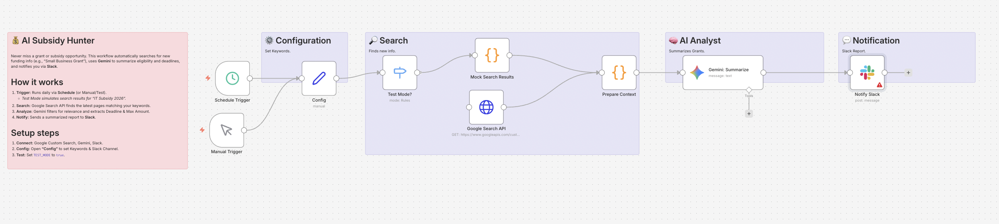

# 15. 【v2.0】AI Subsidy Hunter (全自動・補助金ハンター)

## 🚀 v2.0 メジャーアップデートのお知らせ
以前公開したRSSベースの補助金収集ボットから、大幅なアーキテクチャの刷新を行いました。
RSSを配信していない省庁や自治体の情報を取りこぼす課題を解決するため、**「Google Search APIによる能動的な検索」**と**「Jina AIによるWebページの全文スクレイピング」**を組み込みました。これにより、Geminiがページ本文全体を読み込み、より高精度に「自社に適合する補助金かどうか」を判定できるようになりました。

## ✨ 機能概要
毎朝、指定したキーワード（例：IT導入補助金、助成金など）で直近24時間の最新情報をGoogle検索し、見つかったWebページの本文をAI（Gemini）が読み込みます。自社の事業内容に照らし合わせて適合度を判定し、有益な情報のみを要約してSlackへ通知します。

## ⚙️ 使用している技術スタック
* **Google Custom Search API:** 最新のWeb検索結果を取得。
* **Jina AI (Reader API):** 検索結果のURLから、ページ本文をクリーンなMarkdown形式でスクレイピング。
* **Gemini (Google AI):** スキルプロファイルに基づく適合度判定と要約。
* **Slack:** 判定結果の通知。

## ⚠️ 構築時の重要ポイント（ハマりやすい罠）
1. **Google Custom Search APIの制限解除:**
   Google Cloud Consoleにて、APIキーに「Custom Search API」の利用許可を追加しないと `Requests to this API are blocked.` のエラーが発生します。設定後、反映までに数分かかります。
2. **Gemini APIのRate Limit（無料枠制限）回避:**
   無料枠（1分間に15リクエストまで）の制限に引っかからないよう、`Loop Over Items` ノードと `Wait` ノードを組み合わせ、1件処理するごとに8秒程度の待機時間を設けています。

## 🚀 導入手順
1. 本リポジトリの `workflow.json` をn8nにインポートします。
2. `Google Search API` ノードにGCPの認証情報と検索エンジンID（cx）を設定します。
3. `Gemini` ノードにAPIキーを設定し、プロンプト内の「自社の事業内容（例：テレワーク推進コンサルティングを行う有限会社）」をご自身の環境に合わせて書き換えてください。
4. `Slack Notification` ノードに認証情報と通知先チャンネルを設定します。
5. ワークフローをActiveにして完了です。
