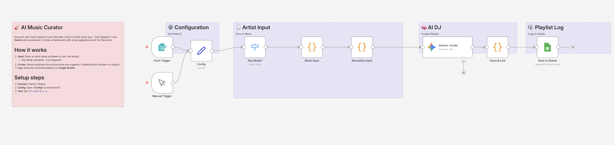

# AI Music Curator: Discover New Favorites 🎸

## Overview
**Expand your musical horizons.**
Stuck listening to the same old playlists? Enter your favorite artist (e.g., "Led Zeppelin", "Daft Punk") into the n8n Form, and **Google Gemini** will analyze their musical style to recommend 3 similar artists. It focuses on "hidden gems" or modern bands with a similar vibe, complete with YouTube search links.

## Key Features
- **🎧 Intelligent Curation:** Finds artists that share the same "DNA" (genre, mood, instrumentation) as your input.
- **🔗 Instant Listening:** Automatically generates YouTube search links for the recommended songs.
- **🧪 Built-in Test Mode:** Simulates a recommendation request for "Led Zeppelin" without needing manual input.

## How It Works
1. **Input:** Submit an artist name via n8n Form.
2. **Curate:** Gemini acts as a music critic to select 3 recommendations.
3. **Link:** The workflow constructs YouTube search URLs for easy listening.
4. **Log:** Saves the recommendations to Google Sheets.

## Setup Steps
1. **Import:** Import `workflow.json` into n8n.
2. **Credentials:** Set up Google Gemini and Google Sheets.
3. **Google Sheets:** Create a sheet named `MusicLog` with columns: `Date`, `Input Artist`, `Rec 1`, `Rec 1 Link`, `Rec 2`, `Rec 2 Link`, `Rec 3`, `Rec 3 Link`.
4. **Config:** Open **"Config"** to set `SHEET_ID`.
