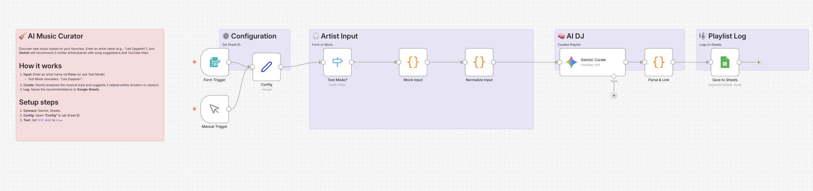

# 🎧 n8n-workflow #16: AI Music Curator
> **「選曲」に脳のリソースを使わない。AIがあなたの状況に合わせて最高の作業空間をデザイン。**

「最高の集中状態（フロー）」に入るためには、適切な音楽が不可欠です。

AI Music Curatorは、Geminiが現在の天気、時間帯、あなたのタスク内容や気分を分析し、Spotify等のストリーミングサービスから「今、この瞬間に最適なプレイリスト」を自動生成。あなたの代わりに選曲を完結させます。

## 🌟 このワークフローで解決すること
- **「BGM探し」による時間喪失の撲滅**: YouTubeやSpotifyの海を漂う時間をゼロにし、即座に実務へ入れます。
- **コンテキストに合わせた最適化**: 「雨の日の月曜日の朝」と「締め切り前の金曜日の夜」で、AIが曲調を自動調整。
- **オフィス環境の自動アップデート**: 毎日変わるプレイリストで、オフィスのマンネリ化を防ぎ、チームの士気を高めます。

## 🛠 主な機能
1. **コンテキスト・センシング**: 天気APIやカレンダーと連携し、「今の状況」をAIが把握。
2. **AI音楽レコメンド**: Geminiが音楽理論や雰囲気に基づき、ジャンルやアーティストを厳選。
3. **自動プレイリスト生成**: Spotify API等と連携し、自分専用の「今日の作業用BGM」を自動作成。
4. **フィードバック学習**: 「今の曲、いいね！」というSlackリアクションから、次回の提案をパーソナライズ。

## 🏗 セットアップ方法
1. **n8nへのインポート**: `ai-music-curator.json` をインポート。
2. **API連携**: 
   - Google AI Studio (Gemini API)
   - Spotify Web API (Client ID / Secret)
   - OpenWeatherMap API (天気連動させる場合)
3. **通知設定**: 生成されたプレイリストURLをSlackやスマホに通知。

---
Produced by [有限会社野田収一事務所](https://alternativecomputers.org/)
「音と技術で、仕事をもっと心地よく。」
