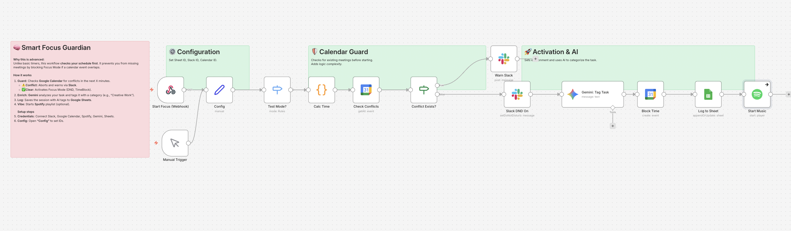

# Smart Focus Mode: Calendar Guard & AI Journaling 🧠

## Overview
**More than just a timer.**
This workflow is a comprehensive "Focus Session" manager. Unlike simple timers, it features a **Calendar Guard**: before starting a focus session, it checks your Google Calendar for overlapping meetings.
- **If there's a conflict:** It aborts and warns you via Slack (preventing accidental meeting skips).
- **If clear:** It activates Slack DND, starts a Spotify playlist, blocks time on your calendar, and uses Gemini to categorize your task for analytics.

## Key Features
- **🛡️ Calendar Guard:** Prevents you from starting deep work if a meeting is scheduled in the next X minutes.
- **🤖 AI Categorization:** Gemini analyzes your task name (e.g., "Draft Proposal") and auto-tags it (e.g., "Creative Work", "Admin").
- **🔇 Environment Control:** Automatically turns on Slack Do Not Disturb and plays Focus Music on Spotify.

## How It Works
1. **Trigger:** Webhook or Manual Trigger (via n8n).
2. **Check:** Queries Google Calendar for events overlapping with the proposed duration.
3. **Branch:**
   - **Conflict:** Sends a Slack warning.
   - **Clear:** Sets Slack DND -> Gemini Tags Task -> Blocks Calendar -> Logs to Sheets -> Plays Music.

## Setup Steps
1. **Import:** Import `workflow.json` into n8n.
2. **Credentials:** Connect Google Calendar, Slack, Spotify, Gemini, and Google Sheets.
3. **Google Sheets:** Create a sheet named `FocusLog` with columns: `Date`, `Task`, `Category`, `Duration`.
4. **Config:**
   - Open **"Config"** to set `SHEET_ID`, `CALENDAR_ID` (usually 'primary'), and `SLACK_USER_ID`.

## Requirements
- n8n v1.x or later
- Google Calendar, Sheets, Gemini API
- Slack Account
- Spotify Premium (for API playback control)
