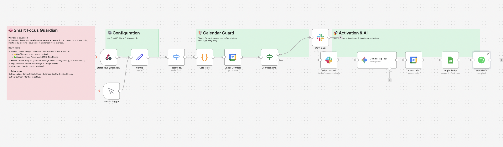

# 🧘‍♂️ n8n-workflow #17: Smart Focus Mode
> **「23分間のロス」を取り戻す。AIと自動化で、あなたの集中力を聖域化するシステム。**

一度のSlack通知で切れた集中力を取り戻すのに、人間は平均23分かかると言われています。

Smart Focus Modeは、あなたが「ここぞ」という時にボタン一つで周囲との通信を遮断し、同時に「いつ戻るか」を周囲に丁寧に伝えることで、集中と協調を両立させるワークフローです。

## 🌟 このワークフローで解決すること
- **「返信しなきゃ」という強迫観念からの解放**: Slackステータスを自動更新し、DND（おやすみモード）を起動。
- **「無視された」と思わせない気遣い**: AIが現在のタスクから「復帰予定時刻」を算出し、メンションしてきた相手に自動でリプライ。
- **スマートデバイスとの連動**: 物理的なスマートライトを赤色に点灯させたり、特定の音楽を流すことで、家族や同僚に「今は入室禁止」を視覚的に伝達。

## 🛠 主な機能
1. **ワンクリック・ディープワーク**: Slack/スマホ/物理ボタンから一斉に「フォーカスモード」へ移行。
2. **AI状況説明**: Geminiがあなたのカレンダーやタスクを読み取り、「今は〇〇の設計に集中しています。15時までお待ちください」といった最適な返信案を作成。
3. **自動復帰システム**: 設定したタイマーが切れると、自動でステータスを元に戻し、未読の通知を要約して提示。
4. **集中ログの可視化**: 1日でどれだけ「深い集中」ができたかをスプレッドシートに記録。

## 🏗 セットアップ方法
1. **n8nへのインポート**: `smart-focus-mode.json` をインポート。
2. **Slack連携**: ユーザープロフィールの変更権限を持つTokenを設定。
3. **カレンダー連携**: Google Calendarから次の予定を取得し、タイマーのデフォルト値を設定。
4. **（オプション）IoT連携**: SwitchBotやHueなどのスマートプラグ/ライトの設定。

---
Produced by [有限会社野田収一事務所](https://alternativecomputers.org/)
「あなたの『深い思考』を、誰にも邪魔させないために。」
