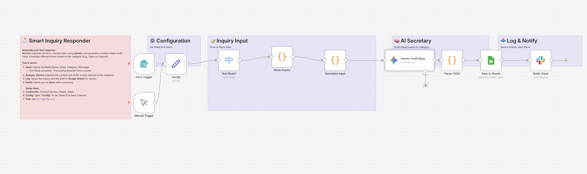

# Smart Inquiry Responder: AI Drafts & Categorization 📩

## Overview
**Automate the "First Draft" of your customer support.**
This workflow intercepts inquiries from a contact form, uses **Google Gemini** to analyze the content and category (e.g., Sales, Media, Support), and automatically generates a polite, context-aware draft reply in Japanese. It then logs everything to Google Sheets and notifies you via Slack.

## Key Features
- **🧠 Context-Aware Drafting:**
  - **Sales:** Generates a persuasive reply with a meeting link.
  - **Media:** Generates a welcoming reply asking for proposal details.
  - **Support:** Generates an empathetic reply promising investigation.
- **📊 Centralized Logging:** Saves all inquiries and AI drafts to Google Sheets for easy review.
- **🧪 Built-in Test Mode:** Simulates a "Consulting Request" without submitting a real form.

## How It Works
1. **Input:** User submits an inquiry via n8n Form (Name, Email, Category, Message).
2. **Analyze:** Gemini acts as a professional secretary to draft a reply based on the category.
3. **Log:** Adds a new row to Google Sheets with the inquiry details and the draft.
4. **Notify:** Sends a summary to Slack, prompting you to review the draft.

## Setup Steps
1. **Import:** Import `workflow.json` into n8n.
2. **Credentials:** Connect Google Gemini, Google Sheets, and Slack.
3. **Google Sheets:** Create a sheet named `Inquiries` with columns: `Date`, `Name`, `Email`, `Category`, `Message`, `AI Draft Subject`, `AI Draft Body`, `Status`.
4. **Config:**
   - Open **"Config"** to set `SHEET_ID` and `SLACK_CHANNEL`.
   - Set `TEST_MODE` to `true` to test.

## Requirements
- n8n v1.x or later
- Google Gemini API Key
- Google Sheets & Slack Account
