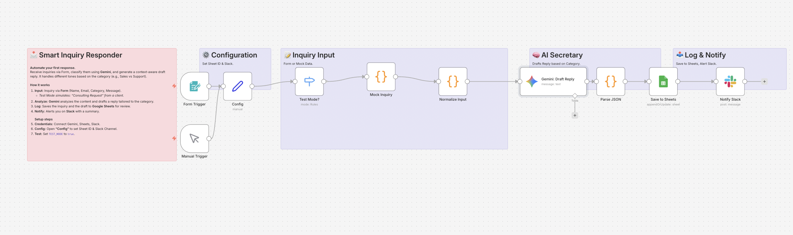

# 💌 n8n-workflow #18: Smart Inquiry Responder
> **「問い合わせ通知」に怯える日々を卒業。AIが文脈を読み、最適な返信案を即座に提示。**

お客様からの問い合わせ。返信が遅れれば信頼を損ない、急げばミスが出る。

Smart Inquiry Responderは、AI（Gemini）が問い合わせ内容を解析し、過去のFAQやあなたの口調を学習して「完璧な下書き」を作成。あなたはSlackに届く回答案を確認し、ボタンを押すだけで返信が完了します。

## 🌟 このワークフローで解決すること
- **「返信文章を捻り出す」苦痛からの解放**: ゼロから文章を書く必要はありません。AIが最適なトーン＆マナーで代筆します。
- **24時間365日の「即レス」体制**: 夜間や休日でも、AIが一時回答や状況説明を自動生成。顧客満足度を爆上げします。
- **対応品質の均一化**: 誰が対応しても、専門知識に基づいた正確で丁寧な回答が可能になります。

## 🛠 主な機能
1. **マルチチャネル対応**: Googleフォーム、メール、ウェブサイトのチャット等から問い合わせを検知。
2. **ナレッジ連携**: 自社のFAQデータやマニュアルをGeminiに読み込ませ、正確な情報を抽出。
3. **人間による最終確認（Human-in-the-loop）**: AIが勝手に送信するのではなく、Slack/Discordで人間に「承認」を求める安全設計。
4. **感情分析**: 怒っているお客様には謝罪を厚く、急いでいる方には簡潔に。感情に合わせた文章生成。

## 🏗 セットアップ方法
1. **n8nへのインポート**: `smart-inquiry-responder.json` をインポート。
2. **ナレッジベースの準備**: よくある質問（FAQ）をGoogleスプレッドシートやNotionに用意。
3. **APIキーの設定**:
   - Google AI Studio (Gemini API)
   - Slack (通知・承認用)
   - Gmail / SendGrid (返信用)

---
Produced by [有限会社野田収一事務所](https://alternativecomputers.org/)
「お客様への想いを、AIでもっと丁寧に伝えよう。」
