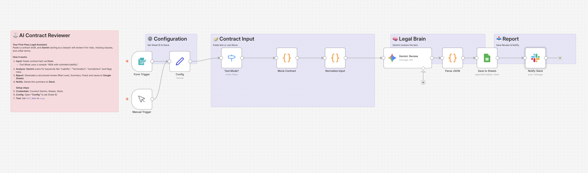

# AI Contract Reviewer: Legal Risk Check ⚖️

## Overview
**Don't sign without a second opinion.**
This workflow acts as your "AI Legal Assistant". You paste the text of a contract (like an NDA or Service Agreement), and **Google Gemini** analyzes it to identify potential risks, unfair clauses, and missing terms. It provides a risk score and specific advice on what to negotiate.

## Key Features
- **🕵️‍♀️ Risk Detection:** Scans for keywords and patterns indicating unfair liability, indefinite terms, or one-sided jurisdiction.
- **📝 Structured Report:** Generates a clean summary with:
  - **Risk Level:** (Low/Medium/High)
  - **Details:** Specific clauses that are problematic.
  - **Fixes:** Suggested wording changes.
- **🧪 Built-in Test Mode:** Includes a sample "Risky NDA" to demonstrate the analysis immediately.

## How It Works
1. **Input:** Paste contract text via n8n Form.
2. **Analyze:** Gemini (configured with a "Senior Legal Advisor" persona) reviews the text.
3. **Log:** Saves the detailed review to Google Sheets.
4. **Notify:** Sends a high-level summary to Slack.

## Setup Steps
1. **Import:** Import `workflow.json` into n8n.
2. **Credentials:** Connect Google Gemini, Google Sheets, and Slack.
3. **Google Sheets:** Create a sheet named `Contracts` with columns: `Date`, `Title`, `Risk Level`, `Summary`, `Details`, `Fixes`.
4. **Config:**
   - Open **"Config"** to set `SHEET_ID` and `SLACK_CHANNEL`.
   - Set `TEST_MODE` to `true` to test.

## Requirements
- n8n v1.x or later
- Google Gemini API Key
- Google Sheets & Slack Account

## Disclaimer
**This tool is for informational purposes only and does not constitute legal advice.** Always consult with a qualified attorney for professional legal counsel.
