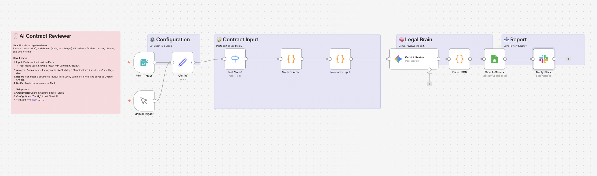

# ⚖️ n8n-workflow #19: AI Contract Reviewer
> **「その契約、サインする前にAIに。見落としがちな『リスク』を3秒で検知。**

契約書のリーディングは、多忙な経営者やフリーランスにとって大きな負担です。

AI Contract Reviewerは、Gemini 1.5 Proが契約書（PDF/画像）を精査。不利な条項、欠けている項目、一般的な慣習とのズレを抽出し、Slackへ「要約とリスク判定」を届けます。

## 🌟 このワークフローで解決すること
- **「ハンコを押す恐怖」の払拭**: プロに頼む前の「一次チェック」をAIが代行。致命的な見落としを防ぎます。
- **難解な法務用語の翻訳**: 複雑な言い回しをAIが噛み砕き、「要するにどういうことか」を平易に解説。
- **チェック時間の劇的な短縮**: 数十ページの契約書も数秒で読破。重要な箇所だけを重点的に確認できます。

## 🛠 主な機能
1. **多角的リスク分析**: 「損害賠償」「契約解除」「反社条項」など、重要項目が漏れていないかAIがスキャン。
2. **AI対話型レビュー**: Gemini 1.5 Proの長いコンテキスト窓を活かし、契約書全体の整合性をチェック。
3. **Slack/メール通知**: 解析結果を構造化して通知。人間が最終的な「GO/NG」を判断するための材料を提供。
4. **OCR対応**: スキャンされたPDFやスマホで撮った契約書画像からもテキストを正確に抽出。

## 🏗 セットアップ方法
1. **n8nへのインポート**: `ai-contract-reviewer.json` をインポート。
2. **チェックリストの定義**: AIに「特に注意して見てほしい点」をプロンプトで指示。
3. **APIキーの設定**:
   - Google AI Studio (Gemini API)
   - 出力先（Slack / Notion 等）

> **⚠️ 免責事項**: 本ワークフローは法的な助言を行うものではありません。最終的な判断は必ず弁護士等の専門家にご相談ください。

---
Produced by [有限会社野田収一事務所](https://alternativecomputers.org/)
「法務の不安を、技術の安心に変える。」
