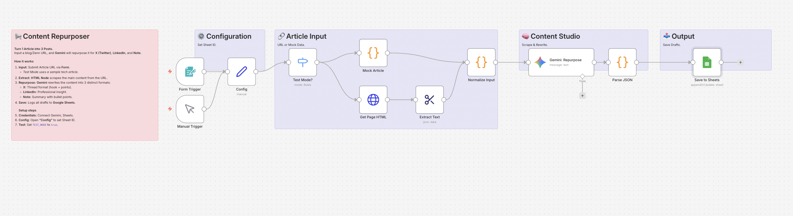

# Content Repurposer: Blog to Multi-SNS 📢

## Overview
**Write Once, Post Everywhere.**
This workflow takes a blog post or article URL (e.g., from Zenn, Medium, or your own site), extracts the content, and uses **Google Gemini** to automatically generate optimized drafts for 3 different social media platforms:
1. **X (Twitter):** A thread starter with a hook and key points.
2. **LinkedIn:** A professional insight post focusing on business value.
3. **Note:** A summary post with key takeaways.

## Key Features
- **🌐 Web Scraping:** Automatically fetches and extracts text from any given URL.
- **🎨 Platform-Specific Tone:** Gemini adjusts its writing style—casual and snappy for X, professional for LinkedIn.
- **📊 Centralized Management:** Saves all generated drafts to Google Sheets for final review and scheduling.

## How It Works
1. **Input:** Submit an article URL via n8n Form.
2. **Extract:** The workflow scrapes the main text content from the page.
3. **Repurpose:** Gemini rewrites the content into 3 formats based on specific prompts.
4. **Save:** Logs the drafts to Google Sheets.

## Setup Steps
1. **Import:** Import `workflow.json` into n8n.
2. **Credentials:** Connect Google Gemini and Google Sheets.
3. **Google Sheets:** Create a sheet named `ContentDrafts` with columns: `Date`, `URL`, `X Post`, `LinkedIn Post`, `Note Post`.
4. **Config:**
   - Open **"Config"** to set `SHEET_ID`.
   - Set `TEST_MODE` to `true` to test with mock data.

## Requirements
- n8n v1.x or later
- Google Gemini API Key
- Google Sheets Account
