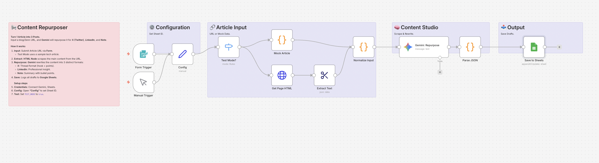

# 🔄 n8n-workflow #20: Content Repurposer
> **「1つのネタ」を「10の資産」へ。AIがあなたの発信を全プラットフォームへ自動最適化。**

渾身のブログ記事が、一回きりの投稿で埋もれていませんか？

Content Repurposerは、Gemini 1.5 Proが元のコンテンツ（ブログ、動画スクリプト、メモ）の核を抽出し、X（旧Twitter）、LinkedIn、メルマガ、Instagram、Notion要約など、各媒体に最適なトーン＆マナーで一括変換します。

## 🌟 このワークフローで解決すること
- **「投稿ネタがない」という恐怖からの解放**: 過去の資産を再利用し、常に新鮮な切り口で発信を継続できます。
- **プラットフォームごとの「書き分け」を自動化**: Xには短文、LinkedInにはビジネス向け、メルマガには親近感。AIがそれぞれの「お作法」を守って代筆。
- **認知の最大化**: 1回の執筆で、リーチできる層を数倍に広げ、「発信疲れ」を根本から解決します。

## 🛠 主な機能
1. **インテリジェント・リライト**: Geminiがソースの文脈を読み、媒体特性に合わせた10種類以上のバリエーションを生成。
2. **トーン＆マナー・コントロール**: 「プロフェッショナル」「親しみやすい」「煽り」など、ブランドに合わせた調整が可能。
3. **シームレス・マルチ投稿連携**: 生成されたテキストをBufferやSocialBu、あるいは直接各SNSのAPIへ飛ばして予約投稿。
4. **構造化アーカイブ**: 変換された全てのテキストをNotionやGoogleスプレッドシートに整理して保存。

## 🏗 セットアップ方法
1. **n8nへのインポート**: `content-repurposer.json` をインポート。
2. **プロンプトのカスタマイズ**: あなたの「声（トーン）」をAIに学習させるための設定を行います。
3. **APIキーの設定**:
   - Google AI Studio (Gemini API)
   - 各SNS連携、または出力先のデータベース認証。

---
Produced by [有限会社野田収一事務所](https://alternativecomputers.org/)
「あなたの価値ある言葉を、届くべき場所へ、余さず届ける。」
