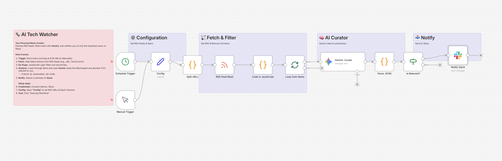

# AI Tech Watcher: Personalized News Curator 🗞️

## Overview
**Stop doom-scrolling. Let AI curate your news.**
This workflow automatically fetches the latest articles from your favorite RSS feeds (e.g., TechCrunch, n8n Blog), filters them based on relevance to your job, and sends a concise 3-point summary to Slack.

## Key Features
- **🤖 AI Relevance Filter:** Gemini analyzes the content and discards irrelevant news.
- **📝 Auto-Summary:** Converts long articles into a 3-bullet point summary in Japanese.
- **🔄 Smart Deduplication:** Uses JavaScript to remember processed articles and prevents duplicate notifications.
- **⚡ Loop Processing:** Handles multiple articles efficiently using the Loop node.

## How It Works
1. **Trigger:** Scheduled to run every morning (or manually).
2. **Fetch:** Gets RSS feeds defined in the Config node.
3. **Filter:** JavaScript code filters out articles that have already been notified.
4. **Loop & Analyze:** Iterates through new articles, asking **Gemini** to rate and summarize them.
5. **Notify:** Sends high-relevance news to Slack.

## Setup Steps
1. **Import:** Import `workflow.json` into n8n.
2. **Credentials:** Connect Google Gemini and Slack.
3. **Config:** Open the **"Config"** node to set:
   - `RSS_URLS`: Comma-separated list of RSS feeds.
   - `SLACK_CHANNEL`: Your target Slack channel.
4. **Test:** Click "Execute Workflow".

## Requirements
- n8n v1.x or later
- Google Gemini API Key
- Slack Account
