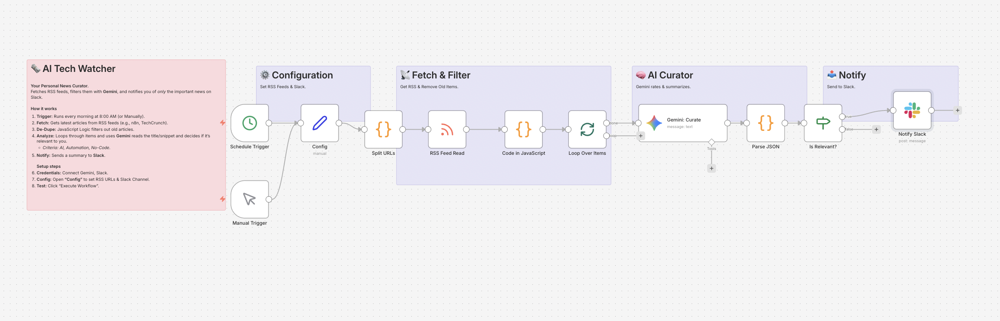

# 📡 n8n-workflow #21: AI Tech Watcher
> **「情報に追われる」のをやめ、「選別された知」を受け取る。AIがあなたの代わりに技術の森を監視。**

技術の進化スピードは、人間が手動でキャッチアップできる限界を超えました。

AI Tech Watcherは、RSS、SNS、テックブログから最新情報を自動収集し、Geminiが「あなたの興味」に合わせて重要度を判定。忙しいあなたのために、3行で要約してSlackへ届けます。

## 🌟 このワークフローで解決すること
- **「後で読む」タブの山を解消**: 100個開いたブラウザのタブを閉じ、本当に読むべき1記事に集中できます。
- **情報収集の「義務感」からの解放**: 毎日サイトを巡回する時間をゼロにし、開発や創造的な業務にリソースを割けます。
- **FOMO（取り残される恐怖）の払拭**: AIが24時間体制でウォッチ。重大なアップデートやトレンドを逃しません。

## 🛠 主な機能
1. **マルチソース・アグリゲーター**: RSS、Qiita、Zenn、海外テックメディアを横断的に監視。
2. **インテリジェント・フィルタリング**: 「JavaScriptに関することだけ」「自社で使っているスタックのニュースだけ」など、Geminiが文脈を判断して取捨選択。
3. **超速要約エンジン**: 長文の記事もGemini 1.5 Flashが瞬時に「3つの要点」へ要約。
4. **パーソナライズ通知**: SlackやDiscordに、アイキャッチ画像とともに整形されたメッセージを配信。

## 🏗 セットアップ方法
1. **n8nへのインポート**: `ai-tech-watcher.json` をインポート。
2. **ソースリストの設定**: 監視したいメディアのURLやキーワードをリストに登録。
3. **APIキーの設定**:
   - Google AI Studio (Gemini API)
   - 各通知ツールの連携

---
Produced by [有限会社野田収一事務所](https://alternativecomputers.org/)
「情報の荒波を、AIという帆で進もう。」
