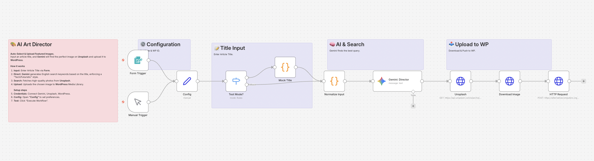

# AI Art Director: Auto Featured Image 🎨

## Overview
**No more stock photo hunting.**
This workflow automatically finds high-quality, tech-themed featured images for your blog posts.
Simply input an article title, and **Gemini** converts it into an optimized search query (e.g., "futuristic AI neural network blue"), fetches the best match from **Unsplash**, and uploads it directly to your **WordPress** Media Library.

## Key Features
- **🧠 Context-Aware Search:** Gemini translates abstract titles into visual keywords.
- **🎨 Style Control:** Enforces a consistent visual tone (e.g., "Abstract", "Tech", "Blue/Purple") suitable for tech blogs.
- **⚡ WordPress Integration:** Automatically uploads the file to your Media Library, ready to be attached to your post.

## How It Works
1. **Input:** Enter your article title (e.g., "The Future of No-Code").
2. **Direct:** Gemini generates a search query: `no-code automation future abstract technology`.
3. **Search:** Unsplash API finds the highest-quality image matching the query.
4. **Upload:** The image is downloaded and pushed to your WordPress site.

## Setup Steps
1. **Import:** Import `workflow.json` into n8n.
2. **Credentials:**
   - **Google Gemini:** API Key.
   - **Unsplash:** Create a free app at [Unsplash Developers](https://unsplash.com/developers) to get an Access Key.
   - **WordPress:** Use an [Application Password](https://make.wordpress.org/core/2020/11/05/application-passwords/) (Users > Profile > Application Passwords).
3. **Config:** Open "Config" to customize the `IMAGE_STYLE` (e.g., remove "blue" if you prefer warm colors).
4. **Test:** Click "Execute Workflow" to see a test image appear in your WP Media Library.

## Requirements
- n8n v1.x or later
- Google Gemini API Key
- Unsplash API Key (Free)
- WordPress Site (w/ App Password)
