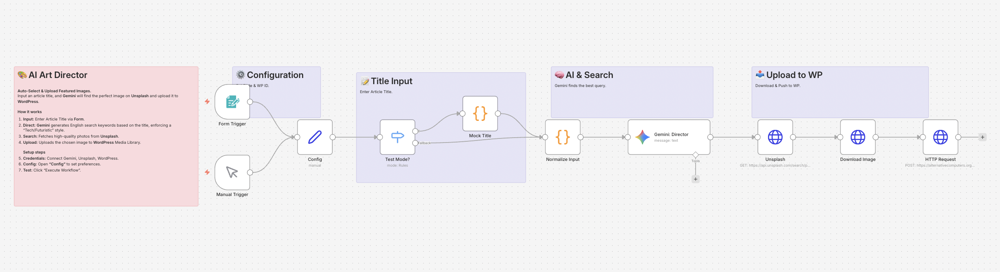

# 🎨 n8n-workflow #22: AI Art Director
> **「言語化できないイメージ」を、プロのビジュアルへ。AIがあなたの『アートディレクター』になる。**

「おしゃれな感じで」「かっこよく」——そんな曖昧なオーダーを、AI（Gemini）が緻密なプロンプトへ翻訳。画像生成AIを自在に操り、あなたのブランドに一貫した世界観をもたらします。

## 🌟 このワークフローで解決すること
- **「プロンプト職人」からの卒業**: 呪文のようなプロンプトを覚える必要はありません。日本語で意図を伝えるだけで、AIが最適な指示書を作成します。
- **デザインの「ガチャ」を終わらせる**: Geminiがアートディレクターとして構図、ライティング、色彩を指示。打率の高いビジュアル生成を実現。
- **ブランドイメージの固定化**: 複数のSNS投稿やバナーでも、AIが「トーン＆マナー」を記憶し、一貫性のあるデザインを量産します。

## 🛠 主な機能
1. **インテリジェント・ディレクション**: 抽象的な日本語入力を、画像生成AIが理解できる高精細な英語プロンプトに変換。
2. **スタイル・プリセット管理**: 「ミニマル」「サイバーパンク」「水彩画風」など、自社専用のスタイルをAIに定義。
3. **バリエーション自動生成**: 1つのアイデアから、構図や配色を変えた複数の案を同時に提案。
4. **シームレス・デリバリー**: 生成された画像を自動的にGoogleドライブに保存し、Slackでプレビュー。

## 🏗 セットアップ方法
1. **n8nへのインポート**: `ai-art-director.json` をインポート。
2. **ディレクター設定**: Geminiノードで、あなたの「好み」や「ブランドガイドライン」を学習させます。
3. **APIキーの設定**:
   - Google AI Studio (Gemini API)
   - 画像生成サービス（Imagen 3 / DALL-E / Midjourney等）のAPI/Webhook

---
Produced by [有限会社野田収一事務所](https://alternativecomputers.org/)
「誰もが、自分の中のクリエイティビティを形にできる世界へ。」
